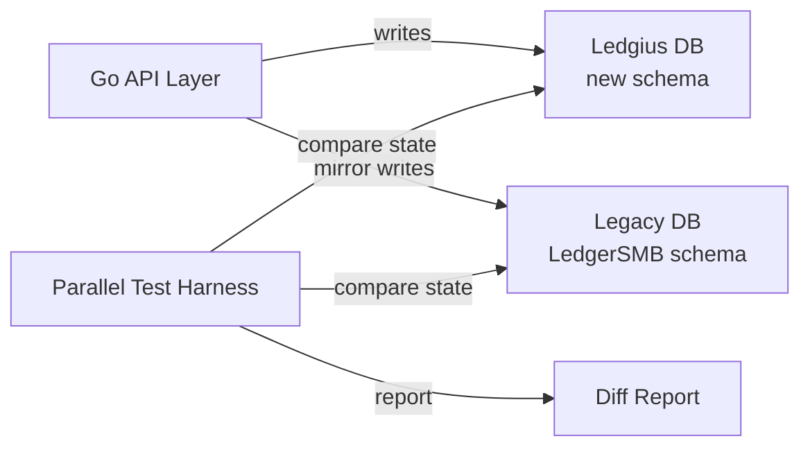

ID: A-0016
Title: Dual Database Strategy
Domain: Architecture/Dual Database Strategy
Feature: dual-database-strategy
Status: Implemented
Owner: Team Ledger
Created: 2026-04-09
Updated: 2026-04-09
Related Requirements:
Related Architecture:
  - A-0009
  - A-0010
  - A-0015
Related Tasks:
Related AI Guidance:
Impacted Repositories:
  - ledgius
Supersedes:
Superseded By:

# Summary

Defines the dual-database architecture for Ledgius: running two PostgreSQL databases side-by-side during development and migration. Every operation is executed against both databases and outcomes are compared automatically. Covers database instances, Docker Compose layout, parallel testing approach, schema evolution strategy across three phases (Mirror, Diverge, Consolidate), and migration tooling.

# Requirement Link

N/A — foundational architecture document governing the database strategy during migration from LedgerSMB to Ledgius.

# Technical Context

Ledgius is progressively migrating from LedgerSMB's PostgreSQL schema (172 tables, 500+ stored procedures) to an evolved Ledgius schema. During this migration, both databases must be kept in sync to verify that the new Go-driven business logic produces identical accounting outcomes to the legacy stored procedures.

# Proposed Design

## Dual-Database Architecture

The core idea: run two PostgreSQL databases side-by-side during development and migration. Every operation is executed against both, and outcomes are compared automatically.



## Database Instances

| Instance | Purpose | Schema Source |
|----------|---------|-------------|
| `ledgius-legacy` | LedgerSMB-compatible database | `sql/Pg-database.sql` + LedgerSMB migrations |
| `ledgius-main` | Evolved Ledgius schema | Ledgius migration scripts (Flyway or goose) |

## Docker Compose Layout

```yaml
# docker/docker-compose.yml (conceptual)
services:
  db-legacy:
    image: postgres:16
    environment:
      POSTGRES_DB: ledgius_legacy
    ports:
      - "5433:5432"
    volumes:
      - legacy-data:/var/lib/postgresql/data

  db-main:
    image: postgres:16
    environment:
      POSTGRES_DB: ledgius
    ports:
      - "5434:5432"
    volumes:
      - main-data:/var/lib/postgresql/data
```

## Parallel Testing Approach

### What gets compared

For each accounting operation (post invoice, receive payment, reconcile, etc.):

1. **GL entries** — both databases must produce identical journal entries (accounts, amounts, dates)
2. **Trial balance** — period-end balances must match
3. **Sub-ledger balances** — AR/AP/inventory must agree
4. **Audit trail** — transaction metadata must be equivalent

### How it works

1. The Go API executes the operation against the Ledgius DB using the new schema/logic.
2. A shadow writer translates and executes the equivalent operation against the legacy DB using LedgerSMB's stored procedures.
3. A comparison harness queries both databases and produces a diff report.
4. CI fails if any accounting-significant differences are detected.

### What is NOT compared

- UI-specific metadata (user preferences, session data)
- Performance characteristics (query plans may differ)
- Internal IDs (sequences will diverge)
- Audit timestamps (only logical equivalence matters)

## Schema Evolution Strategy

### Phase 1: Mirror

- Ledgius DB starts as a copy of the LedgerSMB schema
- Both databases are structurally identical
- Parallel tests are trivially 1:1

### Phase 2: Diverge

- Ledgius schema evolves (new tables, renamed columns, normalisation changes)
- Shadow writer handles translation between schemas
- Comparison queries use views/mappings to align differing structures

### Phase 3: Consolidate

- Legacy DB becomes read-only reference
- Parallel testing shifts to regression suite
- Eventually legacy instance is decommissioned

## Migration Tooling

| Tool | Purpose |
|------|---------|
| Flyway or goose | Schema migrations for Ledgius DB |
| LedgerSMB's built-in migrations | Schema changes for legacy DB |
| Custom Go harness | Parallel write + comparison logic |
| pgTAP (optional) | Database-level unit tests |

# Affected Components

- `docker/docker-compose.yml` — dual PostgreSQL service definitions
- `api/pkg/db/` — dual-DB connection manager
- `api/pkg/parity/` — comparison harness
- `api/pkg/dualpost/` — dual-post gateway (shadow writer)
- `api/migrations/` — Ledgius-specific migration scripts
- `sql/` — legacy schema and stored procedures
- CI pipeline — parallel DB verification

# Data Flow

```
Go API Layer
  --> Ledgius DB (new schema, GORM writes)
  --> Legacy DB (LedgerSMB schema, stored procedure calls via shadow writer)
  --> Parallel Test Harness
    --> Query both databases
    --> Compare GL entries, trial balance, sub-ledger balances, audit trail
    --> Produce diff report
    --> CI pass/fail
```

# API / Interface Changes

No external API changes. The dual-database architecture is internal infrastructure. The Go API presents a single interface regardless of whether one or two databases are active.

# Storage / Schema Changes

### Ledgius DB (port 5436)
- Starts as clone of legacy schema
- Evolves with Ledgius-specific tables (`bank_transaction`, `import_batch`, `bank_rule`)
- Managed by Flyway or goose migration scripts

### Legacy DB (port 5435)
- Full LedgerSMB schema with 172 tables, 500+ stored procedures
- Managed by LedgerSMB's built-in migration system
- Both databases loaded with Australian COA (100 accounts, 11 headings, GST)

# Background Processing

- Shadow writer executes mirror writes to legacy DB during dual-post mode
- Scheduled comparison jobs in staging/production verify aggregate financial state
- Diff reports generated automatically on divergence detection

# Risks / Trade-offs

- **Infrastructure cost** — Running two PostgreSQL instances doubles database resource usage during migration. This is temporary and justified by safety.
- **Schema drift management** — As Ledgius schema diverges from legacy, maintaining the translation layer (shadow writer, comparison views) requires ongoing effort. Decreases as domains are fully extracted.
- **Comparison query complexity** — Column name mappings and structural differences make comparison queries increasingly complex in Phase 2. Mitigated by schema-aware parity assertion helpers.

# Alternatives Considered

- **Single database with feature flags**: Running old and new logic against the same database. Rejected — does not verify that schema changes produce identical outcomes.
- **Snapshot-based comparison**: Comparing database snapshots before and after operations. Rejected — too slow and coarse-grained for per-operation verification.
- **Event sourcing bridge**: Using an event store to replay operations against both schemas. Rejected — adds significant architectural complexity beyond what is needed for migration verification.

# Test Strategy

- Per-operation parity tests comparing Go-driven writes (Ledgius DB) against stored-procedure-driven writes (Legacy DB)
- Trial balance reconciliation tests at aggregate level
- Schema migration tests verifying Flyway/goose scripts apply cleanly
- Column mapping tests verifying parity assertions handle schema divergence correctly
- Full mock data parity suite (20 checks, run via `make go-parity-full`)

# Rollout / Migration Notes

- **Phase 1 (Mirror)**: Both databases structurally identical. Parity tests are trivially 1:1. Run `make docker-init` to bootstrap both databases with Australian COA and admin user.
- **Phase 2 (Diverge)**: Ledgius schema evolves. Shadow writer and comparison views handle translation. Parity tests use column mappings.
- **Phase 3 (Consolidate)**: Legacy DB becomes read-only reference. Parallel testing shifts to regression suite. Eventually `ModeLedgiusOnly` and legacy instance decommissioned.

# Related Documents

- A-0009 (Accounting Backend Architecture Principles)
- A-0010 (Transaction Management & Business Logic Extraction)
- A-0015 (Migration Safety Framework)
