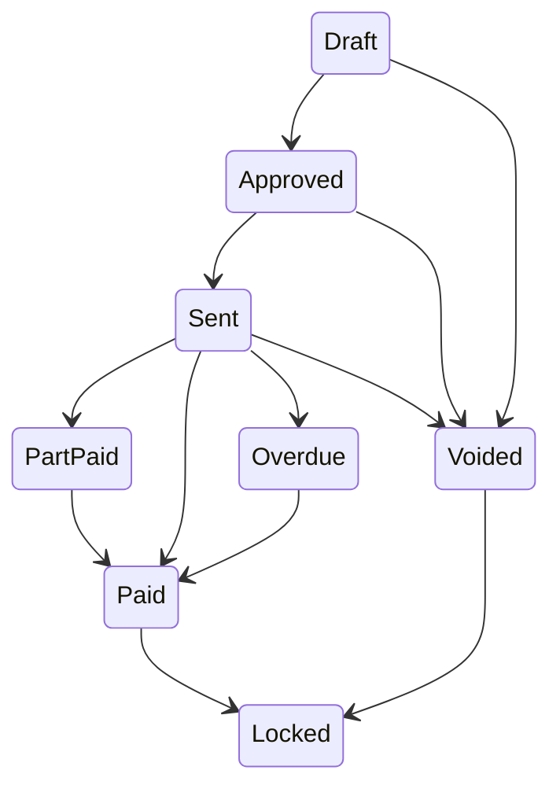
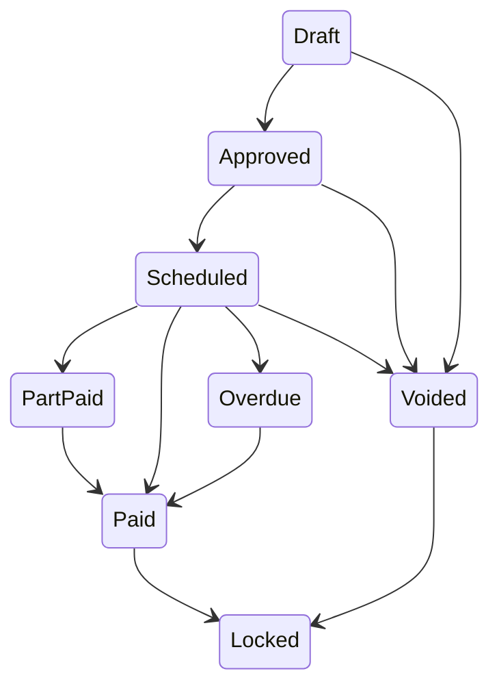
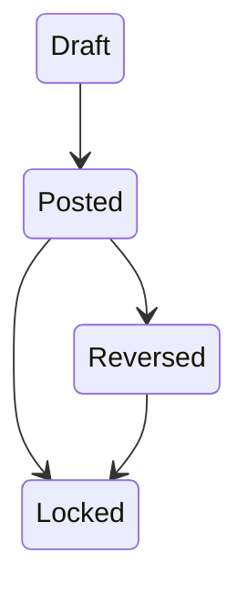
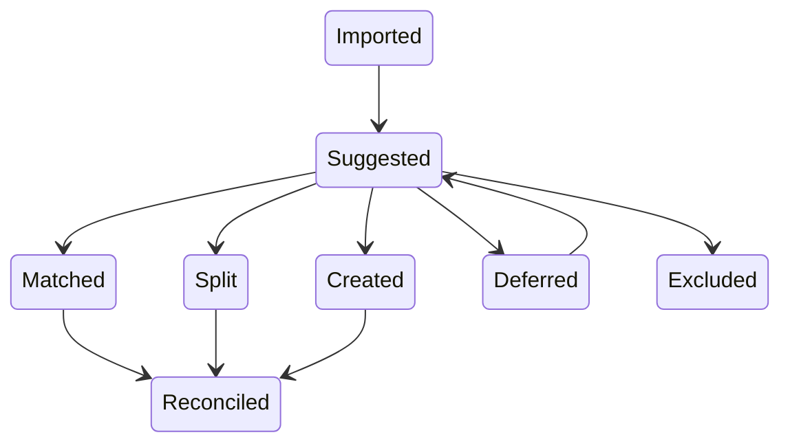
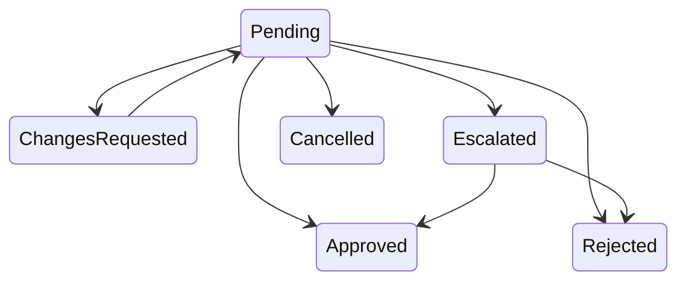
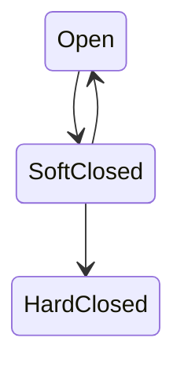

ID: A-0012
Title: Accounting State Machine Specification
Domain: Architecture/Entity State Machines
Feature: entity-state-machines
Status: Implemented
Owner: Team Ledger
Created: 2026-04-09
Updated: 2026-04-09
Related Requirements:
Related Architecture:
  - A-0009
  - A-0011
  - A-0014
Related Tasks:
Related AI Guidance:
Impacted Repositories:
  - ledgius
Supersedes:
Superseded By:

# Summary

Defines explicit lifecycle states, transition rules, invariants, and side effects for all core accounting entities in Ledgius: invoices, bills, journal entries, bank line reviews, approval requests, periods, and contacts. Establishes a generic transition contract and rules for blocking vs warning, side effects, UI rendering, audit events, and testing.

# Requirement Link

N/A — foundational architecture document that drives backend command validation, frontend status rendering, audit event generation, permission checks, and workflow gating across all entity types.

# Technical Context

Accounting entities have complex lifecycles where the current state determines allowed actions, validation rules, accounting behaviour, audit expectations, and UI affordances. This specification replaces ad-hoc state management with explicit, enforced state machines that are consistent across backend and frontend.

# Proposed Design

## 1. State Machine Principles

### 1.1 States are domain rules, not labels

A state is meaningful only if it changes: allowed actions, validation rules, accounting behaviour, audit expectations, or UI affordances.

### 1.2 All transitions are explicit

No implicit state changes via direct database updates. Transitions should happen through business-intent commands.

### 1.3 Posted financial truth is immutable

Any state after posting must preserve accounting immutability. If the business meaning changes after posting, use: reversal, credit, void where allowed, or adjustment. Not direct overwrite.

### 1.4 UI must always expose state and why it matters

State display should include: current state, whether editable, whether financially posted, next valid actions, and whether period/lock constraints apply.

## 2. Shared State Concepts

### 2.1 Common flags

Across entities, support distinct concepts for:
- lifecycle state
- posting state
- payment/reconciliation state
- approval state
- lock state

Do not collapse these into one overloaded status field.

### 2.2 Recommended normalized concepts

- **Lifecycle state**: Business workflow stage
- **Posting state**: Whether journal impact exists
- **Settlement state**: Whether payment/allocation/reconciliation completed
- **Lock state**: Whether the record may still be directly mutated

## 3. Invoice State Machine

### 3.1 States

Draft, Approved, Sent, PartPaid, Paid, Overdue, Voided, Reversed, Locked

### 3.2 State diagram



### 3.3 State definitions

**Draft**: Editable business document; not yet financially committed. Allowed actions: edit, delete draft if policy permits, approve, void draft.

**Approved**: Validated and ready for send/post; may still be editable in limited ways if not posted. Allowed actions: send, post if separate action exists, revert to draft if policy allows, void.

**Sent**: Customer-facing active receivable; may be posted and awaiting payment. Allowed actions: record payment, issue credit note, mark dispute, void only if accounting rules permit and no settlement exists.

**PartPaid**: Settlement has started but outstanding remains. Allowed actions: allocate further payments, issue partial credit, review outstanding.

**Paid**: Fully settled. Allowed actions: view, reverse payment or issue correcting adjustment via controlled flow.

**Overdue**: Still unpaid past due date. Allowed actions: record payment, send reminder, place on collections workflow.

**Voided**: Document cancelled through approved path. Allowed actions: view, audit.

**Locked**: Terminal direct edit state. Allowed actions: view, linked corrective action only.

### 3.4 Invariants

- invoice total must equal line total + tax logic
- paid invoices cannot be directly edited
- sent/posted invoices cannot mutate core financial values without controlled correction flow
- void must preserve audit history

### 3.5 Transition triggers

| From | To | Trigger |
| --- | --- | --- |
| Draft | Approved | `approve_invoice` |
| Approved | Sent | `send_invoice` |
| Sent | PartPaid | `record_payment` partial |
| Sent | Paid | `record_payment` full |
| Sent | Overdue | due date monitor |
| Overdue | Paid | `record_payment` |
| Draft/Approved/Sent | Voided | `void_invoice` |
| Paid | Locked | settlement finalization / policy lock |

### 3.6 Required audit events

invoice created, invoice updated, invoice approved, invoice sent, payment allocated, invoice voided, invoice locked

## 4. Bill State Machine

### 4.1 States

Draft, Approved, Scheduled, PartPaid, Paid, Overdue, Voided, Locked

### 4.2 Diagram



### 4.3 Differences from invoices

Bills emphasize: supplier coding correctness, duplicate detection, payment scheduling, approval before payment readiness.

### 4.4 Invariants

- posted bill totals must balance to AP and expense/tax accounts
- paid bills cannot be directly edited
- duplicate-risk does not change state by itself; it adds warning metadata

## 5. Journal Entry State Machine

### 5.1 States

Draft, Posted, Reversed, Locked

### 5.2 Diagram



### 5.3 Definitions

**Draft**: Editable, not yet financially committed. Must show running debit/credit delta.

**Posted**: Committed to ledger. Immutable except through explicit reversal/adjustment mechanisms.

**Reversed**: Original journal remains intact. Linked reversing entry created.

**Locked**: Terminal no-direct-edit state.

### 5.4 Invariants

- total debits == total credits before post
- posting period must be open
- reversal must link to source journal

## 6. Bank Line Review State Machine

### 6.1 Purpose

Represents the workflow state of imported bank statement lines, not necessarily ledger truth itself.

### 6.2 States

Imported, Suggested, Matched, Split, Created, Deferred, Reconciled, Excluded

### 6.3 Diagram



### 6.4 Definitions

**Imported**: Raw bank line received, not yet analysed.

**Suggested**: Matching engine has candidate actions/evidence.

**Matched**: User accepted link to existing transaction(s).

**Split**: User allocated the bank line across multiple ledger outcomes.

**Created**: User created new transaction from the bank line.

**Deferred**: User postponed decision pending later evidence.

**Excluded**: Line intentionally excluded from reconciliation workflow under policy.

**Reconciled**: Final reviewed state with ledger alignment established.

### 6.5 Invariants

- reconciled amount must net to imported bank line amount
- split allocations must sum to bank line amount
- deferred items remain visible in aged exception queues

## 7. Approval Request State Machine

### 7.1 States

Pending, Approved, Rejected, ChangesRequested, Escalated, Cancelled

### 7.2 Diagram



### 7.3 Rules

- rejections require reason
- change requests require reason
- approval may trigger entity lifecycle transition
- approval history must remain visible even after final entity state changes

## 8. Period State Machine

### 8.1 States

Open, SoftClosed, HardClosed

### 8.2 Diagram



### 8.3 Definitions

**Open**: Normal posting allowed.

**SoftClosed**: Posting discouraged or permission-restricted. System should warn and require elevated capability or explicit override path.

**HardClosed**: No ordinary posting allowed. Adjustments require controlled prior-period correction workflow.

### 8.4 Invariants

- no direct mutation of posted records in hard-closed periods
- all override actions must be audited with reason code

## 9. Contact State Machine

### 9.1 States

Active, OnHold, Archived

### 9.2 Rules

- archived contacts cannot be newly transacted against unless explicitly restored
- on-hold contacts may block approval or payment workflows depending on type/policy

## 10. Generic Transition Contract

Every transition should define:

```text
TransitionSpec
  name
  fromStates[]
  toState
  requires[]
  blockers[]
  warnings[]
  sideEffects[]
  auditEventType
```

## 11. Blocking vs Warning Rules

### 11.1 Blockers

Prevent transition. Examples: journal out of balance, posting into hard-closed period, missing mandatory account code, settlement amount exceeds outstanding.

### 11.2 Warnings

Do not block, but require user attention. Examples: unusually large invoice amount, possible duplicate bill, payment date outside normal pattern, posting into soft-closed period with override rights.

## 12. Side Effects by Transition Type

### 12.1 Typical side effects

- create journal entries
- update read models
- emit audit event
- update aging buckets
- trigger notifications
- create linked reversal references
- refresh reconciliation status

### 12.2 Rule

Side effects must be deterministic and transactionally tied to the transition command where required.

## 13. UI Rendering Rules

### 13.1 Status pills

Each state must map to: label, semantic color, icon (optional), tooltip/help copy if needed.

### 13.2 Action gating

Buttons should render based on transition availability, not ad hoc role logic. Examples: `canTransition(invoice, "approve")`, `canTransition(journal, "post")`.

### 13.3 Disabled action explanations

When a transition is unavailable, expose why: imbalance, missing approval, closed period, insufficient permissions.

## 14. Audit Requirements

Each successful transition must append an audit event containing: entity type, entity ID, old state, new state, actor, timestamp, command/correlation ID, reason note if supplied, linked entity IDs if side effects create them.

## 15. Testing Requirements

### 15.1 Required test categories

- valid transition tests
- invalid transition tests
- blocker precedence tests
- warning propagation tests
- side effect assertion tests
- audit append tests
- period-lock interaction tests

### 15.2 Test style

Prefer table-driven tests per entity type.

## 16. Acceptance Criteria

This spec is useful if:

1. backend commands can be implemented directly from it
2. frontend action gating can derive from it
3. audit events can be tied to transitions consistently
4. entity lifecycles stop being ambiguous or ad hoc

# Affected Components

- All domain service layers (`api/internal/*/service.go`) — transition enforcement
- All domain handlers (`api/internal/*/handler.go`) — command validation
- Frontend status rendering (`ledgius-ui/src/shared/components/StatusPill`, `StatusStepper`)
- Audit subsystem — event generation on every transition
- Approval workflow module

# Data Flow

```
Client Command --> Handler (validate command) --> Service (check current state)
  --> TransitionSpec (evaluate blockers/warnings)
  --> If blocked: return error with explanation
  --> If allowed: execute side effects within transaction
  --> Append audit event --> Return new state
```

# API / Interface Changes

- All entity mutation endpoints return the new state and available transitions
- Transition availability exposed via `canTransition()` checks in API responses
- Disabled action explanations returned as structured data for UI rendering

# Storage / Schema Changes

- Entity tables include lifecycle state, posting state, settlement state, and lock state as separate columns (not a single overloaded status field)
- Audit event table: entity_type, entity_id, old_state, new_state, actor, timestamp, correlation_id, reason_note, linked_entity_ids

# Background Processing

- Due date monitor for automatic Sent -> Overdue transitions on invoices/bills
- Settlement finalization for automatic Paid -> Locked transitions based on policy

# Risks / Trade-offs

- **State explosion** — Multiple separate state dimensions (lifecycle, posting, settlement, lock) increase complexity; justified by preventing the ambiguity of a single overloaded status field.
- **Transition enforcement overhead** — Every mutation must check state validity; this is intentional and aligns with accounting correctness principles.

# Alternatives Considered

- **Single status field per entity**: Collapsed all state dimensions into one. Rejected — creates ambiguous states and prevents independent tracking of lifecycle vs posting vs settlement.
- **Implicit state via data presence**: Deriving state from whether certain data exists (e.g. "paid if payment records exist"). Rejected — fragile and hard to audit.

# Test Strategy

- Table-driven transition tests per entity type (valid transitions, invalid transitions)
- Blocker precedence tests ensuring hard blocks take priority over warnings
- Side effect assertion tests verifying all expected mutations occur within the transaction
- Audit append tests verifying correct event structure on every transition
- Period-lock interaction tests verifying posting constraints are enforced

# Rollout / Migration Notes

State machines are implemented per entity type as domains are built. Each entity type gets its transition spec defined before implementation begins. Frontend and backend must agree on the state set and transition rules before coding starts.

# Related Documents

- A-0009 (Accounting Backend Architecture Principles — Principle 21: State Machines)
- A-0011 (Accounting Rules Architecture — GoRules layer for treatment selection)
- A-0014 (UX Principles — status stepper, action gating, state-driven editing)
