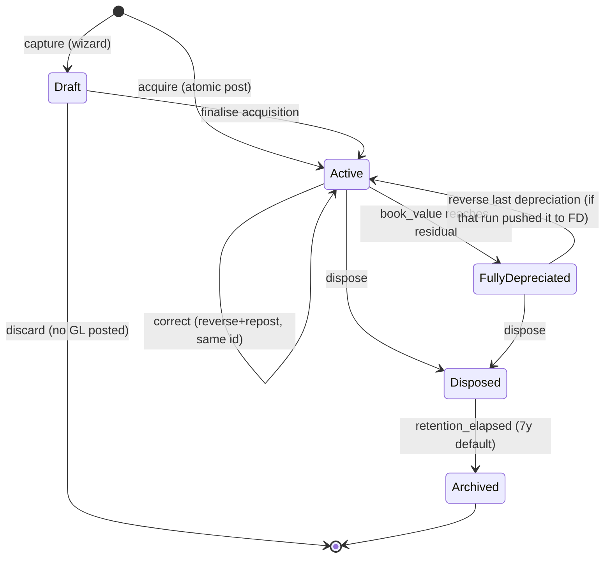

ID: A-0040
Title: Fixed Asset Lifecycle &amp; State Machine
Domain: Architecture/Entity State Machines
Feature: fixed-assets
Status: Draft
Owner: Team Ledger
Created: 2026-04-22
Updated: 2026-04-22
Related Requirements:
  - R-0062
Related Architecture:
  - A-0009
  - A-0012
  - A-0014
  - A-0041
Related Tasks:
  - T-0029
  - T-0031
  - T-0032
Related AI Guidance:
Related Policies:
  - P-0006
Impacted Repositories:
  - ledgius-api
  - ledgius-web-app
  - ledgius-db
Supersedes:
Superseded By:

# Summary

Defines the explicit lifecycle states, legal transitions, invariants, side effects, and audit events for a fixed asset entity under R-0062. Follows A-0012's state-machine pattern: states are domain rules, transitions are business-intent commands, and posted financial truth is immutable (corrections happen through compensating journals, never overwrite).

# Requirement Link

Implements the state-model portion of R-0062. Referenced by T-0029, T-0031, T-0032 for enforcement in backend commands, UI gating, audit event generation, and permission checks.

# Technical Context

A fixed asset has a long-lived, ledger-coupled lifecycle. Every state change has GL consequences (an acquisition journal, a depreciation run, a disposal with gain/loss) and must remain traceable for ATO and audit compliance (P-0006). State must not be inferred from derived values — an asset with zero book value is not automatically "disposed"; it becomes `FullyDepreciated` until the user explicitly disposes it.

# Proposed Design

## 1. State Definitions

| State | Meaning | Editable | Posts dep? | Disposable? |
|---|---|---|---|---|
| **Draft** | Asset captured but acquisition journal not yet posted. Rarely used — acquisition normally posts atomically. Exists for wizard flows where the user is still selecting a bill or supplier. | All fields | No | No |
| **Active** | Asset is on the books, depreciating per its method. Primary operational state. | Non-posting fields only in-place; posting-impacting fields via Correct flow. | Yes | Yes |
| **FullyDepreciated** | Book value has reached residual. Accrues no further depreciation but remains on the books. | Non-posting fields only. | No | Yes |
| **Disposed** | Asset has been sold, scrapped, donated, or traded in. Disposal journal has posted. Remains queryable forever; filtered from default register view. | Non-posting fields only (description, notes). | No | No (already disposed) |
| **Archived** | Disposed **and** beyond the tenant's audit-retention window (configurable, default 7 years). Soft-hidden from all UI surfaces. | No | No | No |

`Draft` is optional — straight acquisition submit bypasses it and lands in `Active`.

## 2. State Diagram

## 3. Transitions

Each transition is a named backend command in the asset service. A command is the **only** way to change state.

| Command | From | To | Function permission | Side effects |
|---|---|---|---|---|
| `AcquireAsset` | (none) | Active | `assets:create` | Create `asset_register` row; post acquisition journal per A-0041; write audit `acquired`; optionally create/link bill. All in one tx. |
| `CaptureDraftAsset` | (none) | Draft | `assets:create` | Create `asset_register` with status=draft, no GL. Write audit `captured`. |
| `FinaliseDraftAsset` | Draft | Active | `assets:create` | Post acquisition journal per A-0041; write audit `acquired`. |
| `DiscardDraftAsset` | Draft | (deleted) | `assets:create` | Delete asset row; write audit `discarded`. Valid only while draft. |
| `EditAssetNonPosting` | Active, FullyDepreciated, Disposed | (same) | `assets:edit` | Update name, description, business_use_pct. Write audit `edited` with diff. |
| `CorrectAsset` | Active, FullyDepreciated | Active | `assets:correct` | Post reversal journal for original acquisition + all posted dep; post fresh acquisition journal with corrected fields. Two audit rows linked by `correction_id`. Accumulated dep, book value recomputed. |
| `RunDepreciationForAsset` | Active | Active OR FullyDepreciated | `assets:run_depreciation` | Part of a period depreciation run (see T-0032). Posts Dr depreciation expense / Cr accumulated depreciation. Updates accumulated. If book_value ≤ residual post-run, transitions to FullyDepreciated. |
| `ReverseLastDepreciation` | Active, FullyDepreciated | Active | `assets:reverse_depreciation` | Post offsetting journal for the last depreciation run line touching this asset; roll back accumulated; write audit `dep_reversed`. If asset was FullyDepreciated, return to Active. |
| `DisposeAsset` | Active, FullyDepreciated | Disposed | `assets:dispose` | If partial period since last dep run, post pro-rata dep first (same tx). Post disposal journal per A-0041 (clear accumulated, credit capital, record gain/loss). Write audit `disposed`. |
| `ArchiveAsset` | Disposed | Archived | system only (retention job) | Flip status; no GL effect; write audit `archived`. |
| `ReverseDisposal` | Disposed | Active OR FullyDepreciated | `assets:correct` | Post offsetting journal for the disposal; restore previous state. Rare — only when disposal was wrong. Write audit `dispose_reversed`. Must occur before `Archived`. |

All other attempted transitions are rejected with `ErrInvalidAssetTransition`.

## 4. Invariants

- **I1** — `status` transitions only via a named command. Direct UPDATE on `asset_register.status` in any code path outside the asset service is a bug.
- **I2** — Every command runs in one DB transaction; the state change, GL posting, and audit row commit together or not at all.
- **I3** — `asset_register.accumulated_depreciation` equals the signed sum of posted depreciation acc_trans rows against the asset's accumulated-depreciation account, minus reversals. A reconciliation job runs nightly and flags discrepancies.
- **I4** — `book_value = cost − accumulated_depreciation` is always derived, never stored. UI reads via a computed column or repository method.
- **I5** — A `Disposed` asset never transitions back **except** via `ReverseDisposal` (rare admin action), and only while not yet `Archived`.
- **I6** — An `Archived` asset is terminal; no further transitions are allowed.
- **I7** — `Active` ↔ `FullyDepreciated` is the only pair where the transition direction depends on computed values (book_value vs residual). All others are explicit user intent.
- **I8** — A single period's depreciation run updates many assets in one parent `transactions` row; partial success is not allowed — the whole run rolls back on any per-asset error.

## 5. Side Effects per Transition

| Event | GL | Audit | Events published | UI |
|---|---|---|---|---|
| Acquire | Dr capital, Dr GST (if any), Cr source | `acquired` | `asset.acquired` | Redirect to detail |
| Run depreciation | Dr dep expense, Cr accum dep (per asset in parent run) | `dep_posted` per asset | `asset.depreciated` | Refresh schedule + history |
| Reverse dep | Offsetting journal | `dep_reversed` | `asset.dep_reversed` | Update accumulated, refresh |
| Dispose | (optional pro-rata dep) + Dr bank/AR, Dr accum, Cr capital, Dr loss / Cr gain | `disposed` | `asset.disposed` | Show disposal summary on detail |
| Reverse disposal | Offsetting journal | `dispose_reversed` | `asset.dispose_reversed` | Asset re-appears in active filter |
| Correct | Reversal + fresh acquisition | `corrected` (two rows) | `asset.corrected` | Refresh detail, flash banner |
| Edit non-posting | — | `edited` with diff | `asset.edited` | Inline update |

`asset.*` events are emitted for downstream consumers (reporting projections, cache invalidation). The event bus contract is specified in A-0015 (observability); asset is a producer of the events listed.

## 6. UI Rendering Rules

Per A-0014, every state has a visible status pill on the detail page and list row. Status colours:

- **Active** — green
- **FullyDepreciated** — amber
- **Disposed** — gray
- **Archived** — not rendered (filtered out)
- **Draft** — neutral with a "finish setup" call to action

Action buttons on the detail page gate strictly to the legal commands for the current state. Disabled buttons include a tooltip explaining why (e.g. "Reverse Last Depreciation — no runs to reverse").

## 7. Concurrency

- Asset-level writes take an advisory lock on `asset_register.id`.
- Depreciation runs take a period lock on `(tenant_id, period_end)` to prevent concurrent runs.
- Reversal + correction flows take the asset lock and the run-period lock for the affected runs.

## 8. Testing Requirements

Per A-0009, every transition must have:

- A unit test that the command posts the exact expected journal (debits, credits, accounts, amounts).
- A unit test that the audit row is written with the correct action + actor + before/after.
- A property test: for any random sequence of valid transitions, `book_value = cost − accumulated_depreciation` and `sum(debits) = sum(credits)` hold at every step.
- A rejection test for every illegal source state per command (e.g. `DisposeAsset` rejects if state is `Disposed` or `Archived`).

# Related Documents

- A-0009 — Ledger principles.
- A-0012 — Parent entity state machine spec (pattern).
- A-0014 — UX principles.
- A-0041 — Asset GL posting contract (companion).
- R-0062 — Fixed asset management (parent requirement).
- T-0029, T-0031, T-0032 — Implementation plans.
