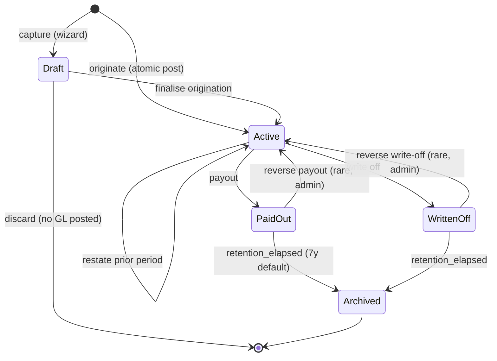

ID: A-0044
Title: Loan Lifecycle &amp; State Machine
Domain: Architecture/Entity State Machines
Feature: loans
Status: Draft
Owner: Team Ledger
Created: 2026-04-22
Updated: 2026-04-22
Related Requirements:
  - R-0063
  - R-0072 (forthcoming — Annual Estimate Review)
  - R-0073 (forthcoming — Tax Layer)
Related Architecture:
  - A-0009
  - A-0012
  - A-0014
  - A-0045
  - A-0042 (forthcoming — BAS Extraction Layer)
Related Tasks:
  - T-0034
  - T-0035
  - T-0036
  - T-0037
Related AI Guidance:
Related Policies:
  - P-0007
Impacted Repositories:
  - ledgius-api
  - ledgius-web-app
  - ledgius-db
Supersedes:
Superseded By:

# Summary

Defines the explicit lifecycle states, legal transitions, invariants, side effects, and audit events for a loan entity under R-0063. Follows A-0012's state-machine pattern and mirrors the structure of A-0040 (fixed-asset state machine) — states are domain rules, transitions are business-intent commands, and posted financial truth is immutable.

# Requirement Link

Implements the state-model portion of R-0063. Referenced by T-0034 (register + detail), T-0035 (payments), T-0036 (payout), T-0037 (accrual engine) for enforcement in backend commands, UI gating, audit event generation, and permission checks.

# Technical Context

A loan has a long-lived, ledger-coupled lifecycle: originated → active for months-to-years → paid out (or written off) → archived. Every state change has GL consequences (origination journal, periodic interest accruals, payment journals, payout journal, write-off journal) and must remain traceable for ATO and audit compliance. State must not be inferred from derived values — a loan with zero balance is not automatically paid-out; the user (or the Payout command) explicitly marks it.

# Proposed Design

## 1. State Definitions

| State | Meaning | Editable | Accrues? | Accepts payments? |
|---|---|---|---|---|
| **Draft** | Captured but origination journal not yet posted. Rare — used when a user is gathering lender + account details before clicking submit. | All fields | No | No |
| **Active** | On the books, accruing interest, receiving payments. Primary operational state. | Non-posting fields only in-place; posting-impacting fields via correction commands. | Yes | Yes |
| **PaidOut** | Final settlement posted via PayoutLoan. Balance + accrued both zero. Remains queryable forever; filtered from default register view. | Non-posting fields only. | No | No (already paid out) |
| **WrittenOff** | Debt forgiven (we are the debtor) or written off as uncollectable. Balance cleared via non-cash journal. | Non-posting fields only. | No | No |
| **Archived** | PaidOut or WrittenOff for beyond the retention window (default 7 years). Soft-hidden. | No | No | No |

`Draft` is optional — `OriginateLoan` bypasses it and lands in `Active`.

## 2. State Diagram

## 3. Transitions

Each transition is a named backend command. A command is the **only** way to change state.

| Command | From | To | Function permission | Side effects |
|---|---|---|---|---|
| `OriginateLoan` | (none) | Active | `loans:create` | Create `loan_register` row; post origination journal per A-0045 §2; write audit `originated`; optionally post establishment-fee journal. All in one tx. |
| `CaptureDraftLoan` | (none) | Draft | `loans:create` | Create `loan_register` with status=draft; no GL; audit `captured`. |
| `FinaliseDraftLoan` | Draft | Active | `loans:create` | Post origination journal per A-0045 §2; audit `originated`. |
| `DiscardDraftLoan` | Draft | (deleted) | `loans:create` | Delete loan row; audit `discarded`. Valid only while draft. |
| `EditLoanNonPosting` | Active, PaidOut, WrittenOff | (same) | `loans:edit` | Update name, description, use-of-funds label, business-use %. Write audit `edited` with diff. Per A-0045 §8.1. |
| `ReclassifyCurrentPeriod` | Active, PaidOut | (same) | `loans:correct` | Same-period reversal + repost. Rejected if period locked. Per A-0045 §8.2. |
| `ChangeLoanEstimate` | Active | Active | `loans:correct` | **Prospective** rate or term change per AASB 108. No GL rows. Appends to `loan.estimate_changes[]`. Audit `estimate_changed` with `{field, old, new, effective_from, reason}`. Future accruals + payment splits use new values. Per A-0045 §8.3. |
| `RestatePriorPeriod` | Active, PaidOut, WrittenOff | (same) | `loans:correct` + `admin:restate_prior_period` | **Retrospective** restatement per AASB 108. Posts current-period correction rows with `restatement_id`. P&amp;L portion → Retained Earnings (Opening). Per A-0045 §8.4. |
| `AccrueInterest` (per-period run) | many Active loans at once | same | `loans:run_accrual` | Calculates this period's interest per eligible loan and posts one parent transaction with debit/credit pairs per loan. Updates `accrued_interest_balance` per loan. Idempotent per period. |
| `ReverseAccrualRun` | run posted | run reversed | `loans:reverse_accrual` | Offsets the original run's rows; flips accrued balances back. Audit `accrual_reversed`. |
| `RecordPayment` | Active | Active | `loans:record_payment` | Posts payment journal per A-0045 §4. Updates `current_balance` and `accrued_interest_balance`. Inserts `loan_payment` row. Audit `payment_recorded`. |
| `ReversePayment` | Active | Active | `loans:record_payment` | Posts offsetting journal for a specific payment. Restores balances. Audit `payment_reversed`. |
| `PayoutLoan` | Active | PaidOut | `loans:payout` | Posts pro-rata accrual + payment clearing principal + accrued + optional termination fee. All in one tx. Audit `paid_out`. Per A-0045 §5. |
| `ReversePayout` | PaidOut | Active OR WrittenOff | `loans:correct` | Posts offsetting journal for the payout. Restores prior state. Audit `payout_reversed`. Rare — only before Archived. |
| `WriteOffLoan` | Active | WrittenOff | `loans:write_off` | Posts the debt-forgiven or bad-debt journal per A-0045 §6. Audit `written_off`. |
| `ReverseWriteOff` | WrittenOff | Active | `loans:correct` + `admin:restate_prior_period` | Offsetting journal. Audit `write_off_reversed`. Rare. |
| `ArchiveLoan` | PaidOut, WrittenOff | Archived | system only (retention job) | Flip status; no GL effect; audit `archived`. |

All other attempted transitions are rejected with `ErrInvalidLoanTransition`.

## 4. Invariants

- **I1** — `status` transitions only via a named command. Direct UPDATE on `loan_register.status` outside the loan service is a bug.
- **I2** — Every command runs in one DB transaction; state change + GL posting + audit row commit together.
- **I3** — `loan_register.current_balance` equals `original_amount − sum(posted_principal_payments) + sum(reversed_principal_payments) − sum(write_off_principal)`. A reconciliation job runs nightly and flags discrepancies.
- **I4** — `loan_register.accrued_interest_balance` equals `sum(posted_accruals) − sum(reversed_accruals) − sum(interest_portion_of_payments) + sum(interest_portion_of_reversed_payments)`. Same nightly reconciliation.
- **I5** — A `PaidOut` loan never transitions back except via `ReversePayout` (admin), and only while not `Archived`.
- **I6** — An `Archived` loan is terminal.
- **I7** — A single period's accrual run updates many loans in one parent `transactions` row; partial success is not allowed.
- **I8** — On `PayoutLoan`, any necessary pro-rata accrual is posted **first** in the same tx; the payout journal then clears the total. If the tenant is on cash-basis interest (per R-0063 LN-006b), the pro-rata accrual is skipped.
- **I9** — Any command that creates, modifies, or reverses GL rows in a period where `period_lock.locked=true` or `bas_lodgement.lodged=true` is rejected with `ErrPeriodLocked`. The only exception is `RestatePriorPeriod`. This enforces A-0045 §10a. Commands affected: `OriginateLoan`, `AccrueInterest`, `ReverseAccrualRun`, `RecordPayment`, `ReversePayment`, `PayoutLoan`, `ReversePayout`, `WriteOffLoan`, `ReverseWriteOff`, `ReclassifyCurrentPeriod`.

## 5. Side Effects per Transition

| Event | GL | Audit | Events published | UI |
|---|---|---|---|---|
| Originate | Dr receiving (bank/capital), Cr loan liability (+ optional establishment-fee rows) | `originated` | `loan.originated` | Redirect to detail |
| Accrue (per run) | Dr interest expense, Cr accrued interest payable (per loan) | `accrual_posted` per loan | `loan.accrual_posted` | Refresh summary |
| Reverse accrual | Offsetting | `accrual_reversed` | `loan.accrual_reversed` | Refresh summary |
| Record payment | Dr accrued int, Dr loan liab, Cr bank (or Dr int expense direct for cash-basis) | `payment_recorded` | `loan.payment_recorded` | Refresh history + balance |
| Reverse payment | Offsetting | `payment_reversed` | `loan.payment_reversed` | Restore balance |
| Payout | (pro-rata accrual) + payment clearing balance + optional fee | `paid_out` | `loan.paid_out` | Mark disposed on list |
| Reverse payout | Offsetting | `payout_reversed` | `loan.payout_reversed` | Loan reappears |
| Write off | Dr loan liab, Dr accrued int, Cr Other Income — Debt Forgiven | `written_off` | `loan.written_off` | Show on list with muted treatment |
| Change estimate | — | `estimate_changed` with diff | `loan.estimate_changed` | Update rate/term; show banner |
| Reclassify | Reversal + fresh origination same-period | `reclassified` | `loan.reclassified` | Refresh detail |
| Restate prior period | Current-period correction with `restatement_id` | `restated` | `loan.restated` | Timeline shows restatement entry |
| Edit non-posting | — | `edited` with diff | `loan.edited` | Inline update |

## 6. UI Rendering Rules

Per A-0014, every state has a visible status pill on the detail page and list row:

- **Active** — green
- **PaidOut** — muted grey
- **WrittenOff** — warning amber
- **Archived** — not rendered (filtered out)
- **Draft** — neutral with a "finish setup" CTA

Action buttons on the detail page gate strictly to the legal commands for the current state. Disabled buttons show a tooltip explaining why (e.g. "Payout — loan already paid out").

## 7. Concurrency

- Loan-level writes take an advisory lock on `loan_register.id`.
- Accrual runs take a period lock on `(tenant_id, period_end)` to prevent concurrent runs.
- Payment + accrual commands within the same loan serialise via the loan-level lock.

## 8. Testing Requirements

Per A-0009, every transition must have:

- A unit test that the command posts the exact expected journal (or, for prospective commands like `ChangeLoanEstimate`, that it posts **no** `acc_trans` rows).
- A unit test that the audit row is written with the correct action + actor + before/after.
- A property test: for any random sequence of valid transitions, `current_balance = original − sum(principal_payments)` and `accrued_interest_balance = sum(accruals) − sum(interest_payments)` and `sum(debits) = sum(credits)` hold at every step.
- A rejection test for every illegal source state per command.
- **I9 period-lock rejection tests** per GL-writing command; `RestatePriorPeriod` is the only command that succeeds against a locked period.
- `ChangeLoanEstimate` tests: no acc_trans rows, `estimate_changes[]` appended, next accrual uses new rate.
- `RestatePriorPeriod` tests: rows in current period only with `restatement_id`, P&amp;L portion → Retained Earnings (Opening), requires both permissions.

# Related Documents

- A-0009 — Ledger principles.
- A-0012 — Parent entity state machine pattern.
- A-0014 — UX principles (including §5c help + policy contract).
- A-0045 — Loan GL posting contract (companion).
- A-0040 — Fixed asset state machine (sibling; same pattern).
- R-0063 — Loan management (parent requirement).
- T-0034/T-0035/T-0036/T-0037 — Implementation plans.
