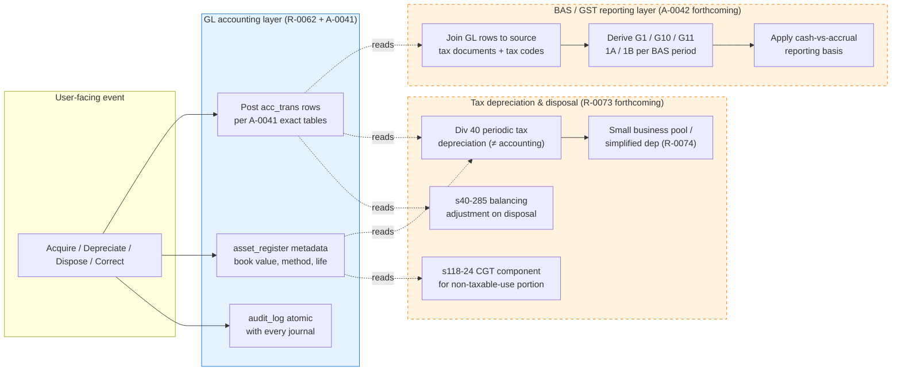
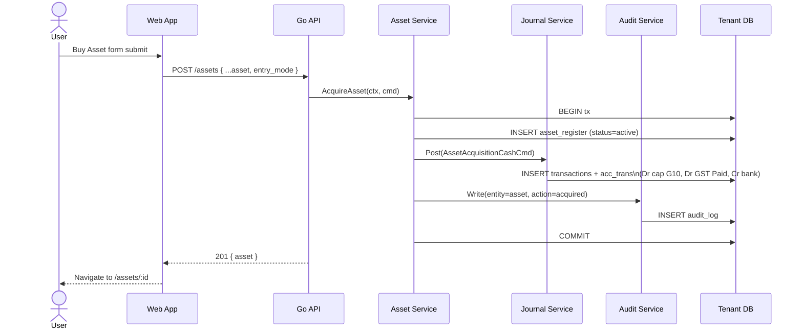
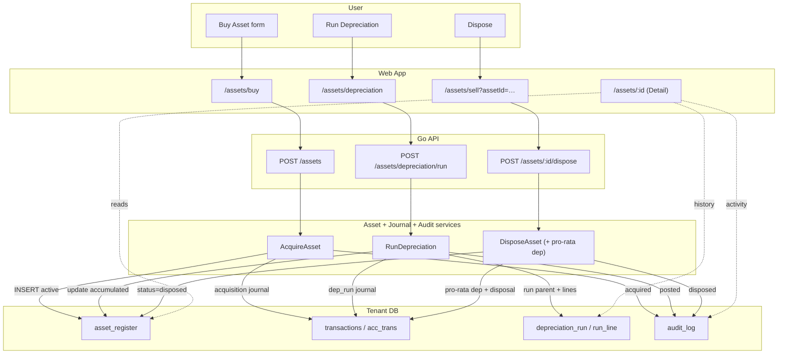

ID: R-0062
Title: Fixed Asset Management
Domain: Assets/Fixed Assets
Feature: fixed-assets
Status: Approved
Owner: Team Ledger
Created: 2026-04-17
Updated: 2026-04-22
Related Requirements:
  - R-0009
  - R-0032
  - R-0071 (forthcoming — Asset Impairment AASB 136)
  - R-0072 (forthcoming — Annual Estimate Review AASB 116 §51)
  - R-0073 (forthcoming — Tax Depreciation &amp; Disposal — Div 40 + CGT s118-24)
  - R-0074 (forthcoming — Small Business Simplified Depreciation / Pool)
Related Architecture:
  - A-0009
  - A-0012
  - A-0014
  - A-0040
  - A-0041
  - A-0042 (forthcoming — BAS Extraction Layer)
Related Tasks:
  - T-0029
  - T-0030
  - T-0031
  - T-0032
Related AI Guidance:
Related Policies:
  - P-0001
  - P-0006
  - P-0008
Impacted Repositories:
  - ledgius-api
  - ledgius-web-app
  - ledgius-db
  - ledgius-specs
Supersedes:
Superseded By:

# Summary

A focused asset management module providing a register view, acquisition, disposal, and depreciation of fixed assets within Ledgius. Every asset event posts a real double-entry journal, writes an audit row, and is reversible only via compensating entries — the ledger remains append-only.

Assets are materialised as rows in a dedicated `asset_register` table that carries depreciation metadata and the current carrying value. All monetary truth still derives from `acc_trans` / `transactions` per A-0009; `asset_register` is a lens and a driver for the posting engine, not a second source of truth.

## Three-layer architecture

This feature writes the **GL accounting layer** only. Two adjacent layers read from the GL to produce their outputs and are specified separately:

- **BAS / GST reporting layer** (forthcoming **A-0042**) — derives G1, G10, G11, 1A, 1B from the GL rows plus source tax documents. BAS labels are **not** tagged onto `acc_trans` rows.
- **Income-tax depreciation &amp; disposal layer** (forthcoming **R-0073**) — computes Div 40 balancing adjustment on disposal, CGT component under s118-24 for non-taxable-use portions, pre-CGT handling, and small-business simplified depreciation where applicable. Tax outcomes do **not** equal the accounting gain/loss computed here.

T-0031 (dispose) does not merge until R-0073 is approved and its implementation stubbed, so disposal code can call the tax layer from day one.

# Problem / Business Context

Australian SMBs must track fixed assets for:

- **Financial reporting** under AASB 116 (PPE), AASB 108 (errors &amp; estimate changes), AASB 136 (impairment).
- **BAS reporting** — capital acquisitions report at G10 (>$1,000) or G11 (≤$1,000), GST on sales at 1A, GST on purchases at 1B per P-0008.
- **Income-tax depreciation** — diminishing value per TR 2022/1, prime cost per s40-70 ITAA 1997, with disposal balancing adjustment per s40-285, and CGT for non-taxable-use portions per s118-24 ITAA 1997. See P-0006.
- **Balance sheet accuracy** — carrying value = cost − accumulated depreciation, with annual estimate review of useful life and residual (AASB 116 §51).

Without a dedicated asset register, users track depreciation in spreadsheets — error-prone, disconnected from the ledger, and invisible to BAS reporting. Correcting a spreadsheet doesn't correct the books; the two drift silently.

# Scope

- **Register**: list view of all capital items with cost, category, depreciation method, useful life, current book value, status.
- **Detail**: per-asset page showing summary, depreciation schedule, past depreciation posts, audit timeline, and dispose action.
- **Acquisition**: record purchase as a standalone journal **or** linked to an existing bill. Writes the capital-acquisition GL and GST input credit. BAS label derivation (G10/G11/1B) is performed by the BAS extraction layer (A-0042).
- **Disposal**: record sale/scrap with accounting gain/loss calculation and compensating GL entries. Asset transitions to Disposed. Div 40 balancing adjustment and any CGT component are computed separately by the tax layer (R-0073).
- **Depreciation** (accounting): calculate and post periodic accounting depreciation entries. Preview before posting, idempotent per period, history of past runs, reversible. Tax depreciation (Div 40) runs in the tax layer from the same asset metadata.
- **Instant write-off** (accounting reflection): fully depreciate an eligible asset in the acquisition period for accounting purposes if the tenant elects simplified depreciation and cost ≤ FY threshold. Tax-side treatment of simplified depreciation / small-business pool is owned by R-0074.
- **Vehicle logbook**: assets of category Motor Vehicles link to the existing logbook; business-use % drives the `deductible` / non-deductible **ledger split** on the depreciation expense rows. The tax outcome (which uses entity type, FBT context, record-keeping basis) is computed in R-0073, not here.
- **Edit / correction**: four distinct paths per AASB 108 — (a) clerical non-posting edit in-place with audit, (b) same-period reclassification reverse+repost, (c) prospective change in accounting estimate (no GL), (d) prior-period restatement to current-period Retained Earnings. See AST-015 and A-0040 §3 / A-0041 §8.
- **Annual estimate review**: useful life and residual are reviewed annually per AASB 116 §51; changes flow via the `ChangeDepreciationEstimate` command. Workflow and calendar reminders are owned by R-0072 (forthcoming); this feature provides the underlying command.

# Out of Scope

## Owned by other (forthcoming) specs — not in this requirement

- **Asset impairment testing (AASB 136)** — owned by R-0071. An impairment write-down is a distinct event type with its own recoverable-amount assessment; deferring keeps R-0062 focused on the happy path.
- **Annual estimate review workflow (AASB 116 §51)** — owned by R-0072. This requirement provides the underlying `ChangeDepreciationEstimate` command; the year-end review workflow, reminder calendar, and accountant sign-off UI live in R-0072.
- **Income-tax depreciation, Div 40 balancing adjustment on disposal, CGT component for non-taxable use, pre-CGT asset handling** — all owned by R-0073. The accounting journals produced here are the input to R-0073's tax computations; R-0073 does **not** write its own GL rows.
- **Small business simplified depreciation / pool** — owned by R-0074. This requirement supports per-asset instant write-off at the accounting layer; pooling logic and small-business eligibility tests live in R-0074.
- **BAS G1/G10/G11/1A/1B label derivation** — owned by A-0042. GL rows here carry no BAS labels; the extractor joins source tax documents + tax codes to produce BAS figures.

## Owned by other modules when built

- **FBT implications for motor vehicles** — belongs in the future FBT / payroll module. This requirement captures `business_use_pct` on the asset and splits depreciation expense at ledger level, which is the input the FBT module will need.
- **Capital works / Div 43 buildings** — different depreciation regime (Div 43 ITAA 1997 at statutory rates, separate from Div 40). When introduced, a new asset category + a companion requirement covers it.

## Genuinely out of scope

- Asset revaluation (upward revaluation per AASB 116 §31–42) — deferred to v2 of this feature.
- Multi-location / multi-site asset tracking.
- Asset maintenance scheduling.
- Asset barcode / QR tagging.
- Componentisation (depreciating sub-components of a single asset separately).
- Multi-currency purchase of a single asset (assumed tenant base currency at acquisition).

# Actors / Users

- **Business Owner** — purchases and disposes of assets.
- **Bookkeeper** — records acquisitions, runs depreciation, reviews register, corrects mistakes.
- **Accountant** — reviews depreciation schedules, verifies disposal gain/loss, approves period closes.

# Preconditions

- Chart of accounts includes asset category accounts (1-2xxx range) per the tenant's COA template.
- Tax codes configured: CAP (or equivalent) for capital acquisitions.
- Depreciation expense + accumulated depreciation accounts exist per asset category (or a shared pair).
- **Gain/loss on disposal accounts exist and are tagged for non-operating presentation**. Under AASB 116 §68, gain on derecognition of PPE is not revenue. The account row carries `reporting_category='other_income'` (for gain) or `'other_expense'` (for loss), which keeps these out of operating-revenue subtotals on the P&amp;L. Either a separate gain/loss pair or a single "Gain/Loss on Disposal of Assets" account is supported; both must carry the reporting category. COA seed templates (`ledgius-db/coa/au`) provide compliant accounts — see **AST-016**.
- ATO instant write-off thresholds seeded per financial year (see **AST-009a**).
- Period-lock and BAS-lodgement tables populated (existing ledger infrastructure) so A-0040 I9 / A-0041 §10a can enforce locks on GL-writing commands.

# Functional Requirements

## Register

- **AST-001**: System shall maintain an asset register with: name, category, purchase date, cost (ex GST), GST amount, supplier, GL account, depreciation method, useful life, residual value, accumulated depreciation, current book value, status, business-use % (for motor vehicles).
- **AST-002**: Asset categories shall include: Plant & Equipment, Motor Vehicles, Office Equipment, Furniture & Fittings, IT Equipment. Extensible per tenant via a `asset_category` table.
- **AST-002a**: Asset register list shall support filters: status (active / disposed / fully_depreciated), category, date range (purchase), and free-text search on name.
- **AST-002b**: Register header shall show totals: count active, total cost, total accumulated depreciation, total current book value.

## Detail

- **AST-012**: Asset Detail page `/assets/:id` displays: header (name, status pill, category, purchase date), summary card (cost, method, residual, book value, next depreciation due), depreciation schedule (per-period projection), depreciation history (past posted runs with journal links), activity timeline (create, edits, dep posts, disposal) sourced from the audit log.
- **AST-012a**: Detail page exposes actions per state: Edit (non-posting fields always; posting-impacting fields via reversal workflow), Dispose (when Active or FullyDepreciated), Reverse Last Depreciation (when at least one run exists and no dispose).
- **AST-012b**: Detail page "Dispose" action launches `/assets/sell?assetId=:id` with the asset pre-selected and current book value pre-loaded.

## Acquisition

- **AST-003**: Depreciation methods shall include: Straight Line, Diminishing Value, Instant Write-off. Method selection per asset.
- **AST-004**: Acquisition shall post a journal with balanced entries per A-0041 §2/§3:
  - Debit the asset's capital GL account (cost ex GST).
  - Debit GST input credit (if GST applies).
  - Credit the payment source (bank for cash purchase, AP account for bill-linked, contra-asset for trade-in).
  - Rows carry `asset_id` and (for bill-reclassification) `reclass_from_bill` tags. **No BAS labels** on GL rows — BAS reporting is derived by A-0042 from source tax documents.
- **AST-004a**: Acquisition flow supports three entry modes: (a) cash (direct bank), (b) create new bill (bill is created with the capital account on the line), (c) link existing bill (reclassification journal moves a bill line to the capital account).
- **AST-004b**: When GST does not apply (GST-free supplier or overseas) the GST row is omitted. The capital row's `reporting_category` and tax code are sufficient for A-0042 to classify it at G11 (≤$1,000) or G10 (>$1,000) — R-0062 does not tag the row.
- **AST-004c**: Acquisition writes one audit row (`entity_type=asset`, `action=acquired`, `entity_id={new asset id}`).

## Disposal

- **AST-005**: Disposal shall calculate **accounting gain/loss** = `sale_ex_gst − current_book_value` and post compensating entries per A-0041 §6:
  - Debit bank/AR for proceeds (ex-GST portion).
  - Credit GST Collected (liability) for GST on sale, if applicable.
  - Debit accumulated depreciation to clear it.
  - Credit the asset's capital account at original cost.
  - Debit Loss on Disposal (`reporting_category='other_expense'`) **or** credit Gain on Disposal (`reporting_category='other_income'`) for the difference, so P&amp;L subtotalling excludes the amount from operating revenue per AASB 116 §68.
  - Rows carry `asset_id` and `disposal=true` tags. **No BAS labels** on GL rows — BAS G1/1A derivation is owned by A-0042.
  - **Tax outcome is separate**: Div 40 balancing adjustment and any CGT component for non-taxable-use portion are computed by R-0073 from the GL rows plus asset metadata. The accounting gain/loss posted here is **not** the tax outcome.
- **AST-005a**: Disposal transitions asset to state `Disposed`. The row is NOT deleted — it remains queryable for audit. List views filter disposed assets by default but allow opt-in display.
- **AST-005b**: Disposal writes one audit row (`action=disposed`, payload includes sale price, gain/loss, reason).
- **AST-005c**: Before final disposal post, if the asset has pending depreciation (period is partial between last run and disposal date), the system shall post a final pro-rata depreciation first, then the disposal. Both journals are created in the same DB transaction.

## Depreciation

- **AST-006**: Run Depreciation shall calculate the period's depreciation for all eligible active assets and post a single parent transaction per run with one child journal pair per asset:
  - Debit Depreciation Expense (per-category account).
  - Credit Accumulated Depreciation (per-category account).
- **AST-006a**: Depreciation period is **monthly**, anchored on calendar month-end in the tenant timezone. Configurable per tenant to quarterly in a later spec (out of scope for R-0062).
- **AST-006b**: Running depreciation twice for the same period is blocked by the `depreciation_run` uniqueness on `(tenant_id, period_end, status=posted)`. A preview endpoint may be re-run freely.
- **AST-006c**: Preview returns the per-asset calculated rows without posting; the UI displays them before the user commits.
- **AST-006d**: A posted depreciation run is reversible via Reverse Run, which creates an offsetting journal and flips run status to `reversed`. The original run row is preserved for audit.
- **AST-006e**: Depreciation runs are listed on `/assets/depreciation` with: period, posted date, actor, total, status, link to parent journal.
- **AST-007**: Straight Line: `annual = (cost − residual) / useful_life_years`; `period = annual × days_in_period / 365`.
- **AST-008**: Diminishing Value: `period = book_value × (days_in_period / 365) × (200% / useful_life_years)` per ATO formula. Floors at residual.
- **AST-009**: Instant write-off: when cost ≤ ATO threshold for the acquisition FY, the full cost less residual is depreciated in the acquisition period. The asset transitions to `FullyDepreciated` after that run.
- **AST-009a**: Instant write-off thresholds are **seeded** in `instant_writeoff_threshold(tenant_id, fy_start, fy_end, threshold_aud)` and updated each FY by a platform-level migration or admin action. The service reads the threshold at acquisition time and caches per-FY. Thresholds are tenant-scoped to allow small-business vs general variants.
- **AST-010**: Fully depreciated assets (`book_value ≤ residual`) transition to `FullyDepreciated`; they remain active for potential disposal but accrue no further depreciation.
- **AST-011**: Register header totals (cost, accumulated, book value) update after every acquisition, depreciation run, reversal, and disposal.

## Audit & Compliance

- **AST-013**: Every asset mutation (acquire, edit, depreciate, reverse-depreciate, dispose) writes an audit row with actor (user_id), timestamp, before/after diff for edits. No asset mutation is complete without its audit row — enforced in the same DB transaction.
- **AST-013a**: Audit retention follows the platform audit policy (no override for assets).

## Vehicle Logbook Integration

- **AST-014**: Assets of category Motor Vehicles carry a nullable `business_use_pct` that splits the depreciation expense posting at **ledger level** into deductible and non-deductible rows (via the `deductible` tag per A-0041 §4). This is presentation metadata — the true **tax** deductibility (entity type, FBT context, record-keeping basis) is computed in R-0073 and is **not** read from the `deductible` tag alone.
- **AST-014a**: The business-use % is initially entered on acquisition and may be refreshed at period end by a logbook-driven update (separate spec — cross-reference when written).

## Correction Paths — AASB 108 distinctions

Four distinct pathways per A-0040 §3 and A-0041 §8. One-size-fits-all is incorrect under AASB 108.

- **AST-015**: **Clerical edit (no GL).** Non-posting fields (name, description, notes) edit in-place with a single `edited` audit row carrying the diff. Corresponds to `EditAssetNonPosting` command. Per A-0041 §8.1.

- **AST-015a**: **Same-period reclassification.** An error caught **before** the period closes — wrong capital account, wrong supplier, wrong GST treatment in the open period. Posts a reversal journal + a fresh acquisition journal in one DB transaction, linked by `correction_id`. Rejected if the target period is locked or BAS-lodged. Corresponds to `ReclassifyCurrentPeriod` command. Per A-0041 §8.2.

- **AST-015b**: **Prospective change in accounting estimate.** Change to `useful_life_years` and/or `residual_value` based on new information (AASB 116 §51, AASB 108 §32–40). This is **not an error** — it is a revised estimate applied **prospectively**. No reversal. No `acc_trans` rows. Appends to `asset.estimate_changes[]`, writes audit `estimate_changed` with `{field, old, new, effective_from, reason}`. Future depreciation runs use the new values. Corresponds to `ChangeDepreciationEstimate` command. Per A-0041 §8.3.

- **AST-015c**: **Prior-period restatement.** Material error affecting prior-period financial statements, where the target period is CLOSED or BAS-lodged. AASB 108 §41–49 requires retrospective restatement — but the ledger is append-only, so we post current-period correction rows tagged `restatement_id`. The P&amp;L portion routes to **Retained Earnings (Opening)**, not current-period P&amp;L. Requires both `assets:correct` and `admin:restate_prior_period` permissions plus a documented reason with reviewer sign-off captured in audit payload. Financial-statement comparatives are re-issued by the reporting layer, which reads these rows and adjusts the comparative column. Corresponds to `RestatePriorPeriod` command. Per A-0041 §8.4.

- **AST-015d**: UI routing — the `/assets/:id` detail page surfaces an "Edit / Correct" menu. The menu presents the four options with plain-language explanations and hints (e.g. "Did you notice this *after* your last BAS was lodged? Choose Prior-period restatement"). The backend enforces the right command regardless of which the user picks; picking the wrong one yields an explanatory error that suggests the correct one.

## Closed-period and BAS-lodgement locks

- **AST-016**: Any asset command that creates, modifies, or reverses GL rows in a period where `period_lock.locked=true` or `bas_lodgement.lodged=true` is rejected with `ErrPeriodLocked`. Applies to `AcquireAsset` (if `purchase_date` in locked period), `RunDepreciation` (if `period_end` locked), `DisposeAsset` (if `disposal_date` locked), `ReverseLastDepreciation` (if target run in locked period), `ReclassifyCurrentPeriod` (if target period locked). Per A-0040 I9 and A-0041 §10a.
- **AST-016a**: The **only** exception is `RestatePriorPeriod` (AST-015c), which posts current-period correction rows tagged `restatement_id` rather than retroactively writing to the locked period.
- **AST-016b**: Bill-linked acquisition specifically: if the original bill sits in a locked/lodged period, the **reclassification** journal must still post to the current open period (not backdated to the bill's period). The reclassification is an adjusting entry in the present, not a rewrite of the past.

## Annual estimate review (entrypoint)

- **AST-017**: The `ChangeDepreciationEstimate` command (AST-015b) is the backend entrypoint used by the annual-estimate-review workflow that R-0072 will specify. This feature provides the command; R-0072 provides the calendar reminder, per-asset review UI, batch-review-by-category flow, and sign-off-by-accountant gate. R-0062 does **not** block on R-0072 — assets can be managed without the annual review workflow, just without the scheduled prompts.

## Help &amp; policy wiring (non-negotiable)

Per A-0014 §5c and project CLAUDE.md, every page added by this feature MUST wire both hooks. The spec enumerates them here so implementation is auditable, not only implicit from the UX-principles doc.

- **AST-018**: Every page listed in the UX section (AST-020–AST-025 below) MUST call:
  - `usePageHelp(pageHelpContent.<slug>)` — binds the F1 help panel to YAML content under `src/locales/en-AU/help/<slug>.yaml`.
  - `usePagePolicies([...domains])` — binds the governing policy slugs surfaced in the help panel.
  Reviewers reject PRs that add a fixed-assets page without both.

- **AST-018a**: Required help YAML files (created under `src/locales/en-AU/help/`, content owned by the implementing task spec):

  | Page | Slug / YAML file | T-00xx owner |
  |---|---|---|
  | Asset Register (`/assets`) | `assetRegister.yaml` | T-0029 |
  | Asset Detail (`/assets/:id`) | `assetDetail.yaml` | T-0029 |
  | Buy Asset (`/assets/buy`) | `buyAsset.yaml` | T-0029 (cash mode) + T-0030 (bill-linked modes) |
  | Sell / Dispose (`/assets/sell`) | `sellAsset.yaml` | T-0031 |
  | Depreciation (`/assets/depreciation`) | `depreciation.yaml` | T-0032 |

- **AST-018b**: Required policy tags — **every** fixed-assets page MUST register the following domains via `usePagePolicies(...)`:

  | Domain tag | Why | Sourced policies (examples) |
  |---|---|---|
  | `account` | Fixed assets are capital GL events — A-0009 ledger principles apply to every page | P-0001 ATO record-keeping |
  | `tax` | Every page touches GST and/or income-tax depreciation context | P-0006 ITAA Div 40, P-0008 GST/BAS |
  | `assets` | New tag dedicated to fixed-asset-specific policies (AASB 116, 108, 136 references) | Added by R-0062 |

  Pages MAY additionally register narrower tags — `capital` on Buy Asset, `disposal` on Sell/Dispose, `depreciation` on Depreciation — to surface context-specific policies on those surfaces. T-00xx specs pick the additional tags per page.

- **AST-018c**: Help YAML content must cover, at minimum, the following topics per page (T-00xx specs list the exact section headings — this is the compliance floor):

  | Page | Mandatory help sections |
  |---|---|
  | Asset Register | What is a fixed asset · How depreciation works · When to dispose · Annual estimate review reminder |
  | Asset Detail | Status meanings · Four correction paths (AST-015 to AST-015c) · When to use which · Reading the activity timeline |
  | Buy Asset | GST on capital acquisitions (BAS G10/G11 derivation, pointer to A-0042) · Entry mode guidance (cash / new bill / link bill) · Instant write-off eligibility and current FY threshold |
  | Sell / Dispose | Accounting gain/loss vs tax outcome (pointer to R-0073 for Div 40 / CGT) · Pro-rata depreciation explanation · Four disposal reasons |
  | Depreciation | Monthly period definition · Why runs are idempotent · Reversing a wrong run · Vehicle business-use split · Annual estimate review link |

- **AST-018d**: Help content must update whenever functional behaviour changes — UI review gates on help-content being current. Stale help is a reviewer-blocker.

# Data / Entities / Fields

## Existing tables leveraged

| Table | Role |
|-------|------|
| `account` | Capital GL accounts (category A), accumulated-depreciation accounts (category A contra), depreciation-expense accounts (category E), gain/loss on disposal accounts (category I/E) |
| `acc_trans` | Individual debit/credit rows for every acquisition, depreciation, disposal |
| `transactions` | Parent transaction for each depreciation run / acquisition / disposal event |
| `audit_log` | Mandatory audit row per asset mutation |
| `ap_invoice` | Optional bill linkage for bill-entry mode of acquisition |

## New tables

| Table | Role |
|-------|------|
| `asset_register` | Primary asset metadata: name, category, purchase_date, cost_ex_gst, gst_amount, useful_life_years, residual_value, depreciation_method, accumulated_depreciation (stored; set to 0 by AcquireAsset and maintained by depreciation/disposal commands; reconciliation job verifies against ledger sums nightly), business_use_pct, status (`active`/`disposed`/`fully_depreciated`/`draft`/`archived` — service sets on INSERT, no DB default), capital_account_id, accum_depreciation_account_id, depreciation_expense_account_id, supplier_entity_id (nullable), linked_bill_id (nullable), acquisition_transaction_id (nullable until Acquire posts; thereafter required for `status='active'`), disposal_transaction_id (nullable), created_at, updated_at |
| `asset_category` | Tenant-configurable categories: code, name, default_capital_account_id, default_accum_depr_account_id, default_depreciation_expense_account_id |
| `depreciation_run` | Per-period run: period_start, period_end, status (`preview`/`posted`/`reversed`), total_amount, parent_transaction_id, posted_by, posted_at, reversed_by, reversed_at |
| `depreciation_run_line` | Per-asset line in a run: asset_id, amount, book_value_before, book_value_after |
| `instant_writeoff_threshold` | FY threshold table: tenant_id (nullable for global default), fy_start, fy_end, threshold_aud |

Schema details live in T-0029 / T-0030 / T-0032.

# UX / UI Behaviour

See A-0014 UX principles and AST-018 for the help + policy wiring contract. Every page in this feature carries an InfoPanel plus `usePageHelp` and `usePagePolicies` with the tags listed in AST-018b (minimum `account`, `tax`, `assets`; per-page additions per each T-00xx spec).

- **AST-020**: Asset Register page displays all assets in a sortable/filterable table with header totals (per AST-002b). Row click opens `/assets/:id`.
- **AST-021**: Buy Asset form captures all acquisition details; submit posts GL + creates asset row + optionally creates/links a bill, all in one DB transaction. On success, navigates to the detail page of the new asset.
- **AST-022**: Sell/Dispose form shows current book value (fetched when asset is selected or pre-populated from query param), calculates gain/loss in real-time as the user enters sale price. Submit posts disposal journal and transitions state.
- **AST-023**: Depreciation page shows: current-period summary ("April 2026 · 12 active assets · $1,234.56 projected"), Preview button → modal with per-asset rows, Run button (disabled while viewing a posted run for current period), past-runs list with Reverse action per run.
- **AST-024**: Every page shows an InfoPanel explaining the workflow and ATO context, persisted via a distinct `storageKey`.
- **AST-025**: Asset Detail page is the primary hub for per-asset actions (Edit, Dispose, Reverse Last Dep) — the sidebar Sell/Dispose link is a secondary entry point for the "I know what I want to sell, pick from a list" flow.

# Validation Rules

- Purchase cost must be > 0.
- Useful life must be ≥ 1 year (except Instant Write-off, where it is null/ignored).
- Residual value must be ≥ 0 and ≤ cost.
- Sale proceeds cannot be negative (zero allowed for scrap).
- Depreciation cannot reduce book value below residual.
- Disposal date must be ≥ purchase date.
- Purchase date cannot be in a locked period.
- Running depreciation on a locked period is blocked.
- Business-use % must be within [0, 100].

# Security / Permissions

Per R-0041 feature + per-role function permissions:

- Feature: `fixed_assets` (plan-gated).
- Functions:
  - `assets:view` — Bookkeeper, Accountant, Owner, Master Accountant, Viewer.
  - `assets:create` — Bookkeeper, Accountant, Owner, Master Accountant.
  - `assets:edit` — Bookkeeper, Accountant, Owner, Master Accountant.
  - `assets:dispose` — Accountant, Owner, Master Accountant.
  - `assets:run_depreciation` — Accountant, Owner, Master Accountant.
  - `assets:reverse_depreciation` — Accountant, Master Accountant only.
  - `assets:correct` — Accountant, Master Accountant only. Gates `ReclassifyCurrentPeriod` and `ChangeDepreciationEstimate`.
  - `admin:restate_prior_period` — Master Accountant only. **Combined with `assets:correct`** to gate `RestatePriorPeriod`. Owner alone is not sufficient — prior-period restatement requires accounting-qualified oversight.

# Acceptance Criteria

## GL &amp; data

- [ ] Asset register lists all assets with current book values and header totals.
- [ ] Asset detail page shows per-asset summary, schedule, history, timeline, and action buttons (per state per A-0040 §6).
- [ ] Buy Asset creates GL entries per A-0041 §2/§3 (no `bas_label` tags); adds to register; optionally creates or reclassifies a bill.
- [ ] Sell/Dispose calculates accounting gain/loss per A-0041 §6 (gain routes to account with `reporting_category='other_income'`); posts compensating GL entries; final pro-rata depreciation runs if needed.
- [ ] Run Depreciation posts correct amounts per method; same period cannot be run twice.
- [ ] Preview shows per-asset rows before Run.
- [ ] Reverse Last Depreciation creates offsetting journal and marks run as reversed.
- [ ] Instant write-off fully depreciates eligible assets in the acquisition period (accounting layer only; tax-side simplified dep owned by R-0074).
- [ ] Disposed / fully-depreciated assets remain in register for audit (filtered by default).
- [ ] Every mutation writes an audit row atomically with the GL post.
- [ ] Ledger invariant test: for any asset across full lifecycle, sum(debits) = sum(credits) on every journal.
- [ ] Permission tests: each function enforced per role; `RestatePriorPeriod` requires both `assets:correct` and `admin:restate_prior_period`.

## Correction paths (AST-015 family)

- [ ] `EditAssetNonPosting` writes `edited` audit row only — no `acc_trans` rows.
- [ ] `ReclassifyCurrentPeriod` reverses+reposts in same tx; rejected when target period is locked.
- [ ] `ChangeDepreciationEstimate` writes `estimate_changed` audit row only — no `acc_trans` rows; subsequent dep runs use new useful life / residual.
- [ ] `RestatePriorPeriod` posts current-period correction rows with `restatement_id`; P&amp;L portion routes to Retained Earnings (Opening), not current P&amp;L.

## Period locks (AST-016)

- [ ] `AcquireAsset`, `RunDepreciation`, `DisposeAsset`, `ReverseLastDepreciation`, `ReclassifyCurrentPeriod` all reject with `ErrPeriodLocked` when target period is locked or BAS-lodged.
- [ ] `RestatePriorPeriod` is the only command that succeeds against a locked period — posting to current period.

## Help &amp; policy (AST-018)

- [ ] Every fixed-assets page (`/assets`, `/assets/:id`, `/assets/buy`, `/assets/sell`, `/assets/depreciation`) calls `usePageHelp(...)` with a bound YAML slug.
- [ ] Every fixed-assets page calls `usePagePolicies([...])` including at minimum `account`, `tax`, `assets`.
- [ ] All five help YAML files (`assetRegister`, `assetDetail`, `buyAsset`, `sellAsset`, `depreciation`) exist under `src/locales/en-AU/help/` and cover the mandatory sections from AST-018c.
- [ ] CI check / PR review rejects any new fixed-assets page without both hooks wired.

## Scope boundaries (forward references)

- [ ] GL rows carry **no** `bas_label` — BAS derivation is A-0042's job.
- [ ] Disposal accounting gain/loss is clearly distinct in docs + UI copy from the tax outcome (Div 40 balancing adjustment + CGT component), which R-0073 owns.
- [ ] T-0031 (dispose) implementation PR references R-0073 as an approved spec and calls its tax layer (or documents a well-scoped stub).

# Data Flow Overview

Three diagrams: a layer separation diagram showing how GL, BAS, and Tax responsibilities sit relative to each other; an acquisition sequence showing the backend call path; and a lifecycle flow covering buy → depreciate → dispose.

## Layer separation

The shaded box is the scope of R-0062. Dashed boxes are adjacent layers specified separately — they **read** from the GL rows produced here, never write them.

## Acquisition sequence (cash entry mode)

## Lifecycle data flow

# Related Documents

## In this PR

- A-0040 — Asset lifecycle & state machine (companion).
- A-0041 — Asset GL posting contract (companion).
- T-0029 through T-0032 — implementation plans.
- `openapi-assets.yaml` — endpoint contract.

## Adjacent (forthcoming) specs

- **A-0042** — BAS Extraction Layer. Derives G1/G10/G11/1A/1B from GL rows + source tax documents. Replaces the previously-proposed `bas_label` tagging on `acc_trans`.
- **R-0071** — Asset Impairment (AASB 136). Write-downs to recoverable amount; distinct event type from routine depreciation.
- **R-0072** — Annual Estimate Review (AASB 116 §51). Calendar workflow + accountant sign-off for useful life / residual review. Uses `ChangeDepreciationEstimate` (AST-015b) as its backend entrypoint.
- **R-0073** — Tax Depreciation & Disposal Layer. Owns Div 40 periodic tax depreciation, s40-285 balancing adjustment on disposal, s118-24 CGT component for non-taxable-use portion, and pre-CGT asset handling. **T-0031 (dispose) does not merge until this spec is approved.**
- **R-0074** — Small Business Simplified Depreciation / Pool. Small-business eligibility tests and pooling logic.

## Foundation

- A-0009 — Ledger principles (immutability, atomicity, idempotency).
- A-0012 — Entity state machine pattern.
- A-0014 — UX principles (including §5c `usePageHelp` + `usePagePolicies` contract referenced by AST-018).

## Policy & standards

- P-0006 — ITAA Div 40 / TR 2022/1 depreciation rules.
- P-0008 — GST & BAS reporting (G1/G10/G11/1A/1B derivation).
- AASB 116 (Property, Plant and Equipment) — recognition, measurement, depreciation, disposal, annual review.
- AASB 108 (Accounting Policies, Changes in Accounting Estimates and Errors) — underpins the four correction paths (AST-015–AST-015c).
- AASB 136 (Impairment of Assets) — owned by R-0071.
- ITAA 1997 Div 40 (capital allowances), s40-285 (balancing adjustment), s118-24 (CGT on depreciating assets for non-taxable-use portion).
- ATO TR 2022/1.
- ATO instant asset write-off thresholds (updated annually).
