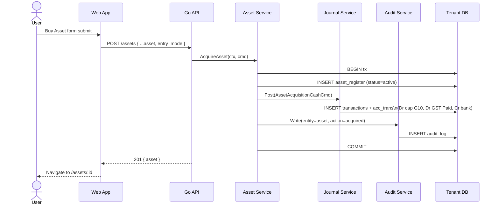
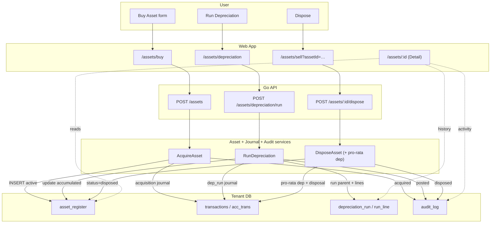

ID: R-0062
Title: Fixed Asset Management
Domain: Assets/Fixed Assets
Feature: fixed-assets
Status: Approved
Owner: Team Ledger
Created: 2026-04-17
Updated: 2026-04-22
Related Requirements:
  - R-0009
  - R-0032
Related Architecture:
  - A-0009
  - A-0012
  - A-0040
  - A-0041
Related Tasks:
  - T-0029
  - T-0030
  - T-0031
  - T-0032
Related AI Guidance:
Related Policies:
  - P-0006
  - P-0008
Impacted Repositories:
  - ledgius-api
  - ledgius-web-app
  - ledgius-db
  - ledgius-specs
Supersedes:
Superseded By:

# Summary

A focused asset management module providing a register view, acquisition, disposal, and depreciation of fixed assets within Ledgius. Every asset event posts a real double-entry journal, writes an audit row, and is reversible only via compensating entries — the ledger remains append-only.

Assets are materialised as rows in a dedicated `asset_register` table that carries depreciation metadata and the current carrying value. All monetary truth still derives from `acc_trans` / `transactions` per A-0009; `asset_register` is a lens and a driver for the posting engine, not a second source of truth.

# Problem / Business Context

Australian SMBs must track fixed assets for:

- ATO instant asset write-off eligibility (threshold changes annually — see P-0006).
- Depreciation calculations: diminishing value per TR 2022/1, prime cost per s40-70 ITAA 1997.
- Capital gains on disposal (CGT event A1).
- BAS capital purchases reporting — label **G10** (GST on capital acquisitions) per P-0008.
- Balance sheet accuracy (carrying value = cost − accumulated depreciation).

Without a dedicated asset register, users track depreciation in spreadsheets — error-prone, disconnected from the ledger, and invisible to BAS reporting. Correcting a spreadsheet doesn't correct the books; the two drift silently.

# Scope

- **Register**: list view of all capital items with cost, category, depreciation method, useful life, current book value, status.
- **Detail**: per-asset page showing summary, depreciation schedule, past depreciation posts, audit timeline, and dispose action.
- **Acquisition**: record purchase as a standalone journal **or** linked to an existing bill. Writes the capital-acquisition GL + GST input credit tagged for BAS G10.
- **Disposal**: record sale/scrap with gain/loss calculation and compensating GL entries. Asset transitions to Disposed.
- **Depreciation**: calculate and post periodic depreciation entries. Preview before posting, idempotent per period, history of past runs, reversible.
- **Instant write-off**: auto-detect eligible assets at acquisition and fully depreciate in the acquisition period if the FY threshold applies.
- **Vehicle logbook**: assets of category Motor Vehicles link to the existing logbook; business-use % adjusts deductible depreciation.
- **Edit / correction**: edit allowed for non-posting-impacting fields (name, description) at any state. Cost/method/useful-life changes require a reversal-and-repost workflow — never in-place mutation.

# Out of Scope

- Asset revaluation (upward revaluation per AASB 116) — deferred to v2.
- Asset impairment testing (AASB 136).
- Multi-location / multi-site asset tracking.
- Asset maintenance scheduling.
- Asset barcode / QR tagging.
- Componentisation (depreciating sub-components of a single asset separately).
- Multi-currency purchase of a single asset (assumed tenant base currency).

# Actors / Users

- **Business Owner** — purchases and disposes of assets.
- **Bookkeeper** — records acquisitions, runs depreciation, reviews register, corrects mistakes.
- **Accountant** — reviews depreciation schedules, verifies disposal gain/loss, approves period closes.

# Preconditions

- Chart of accounts includes asset category accounts (1-2xxx range) per the tenant's COA template.
- Tax codes configured: CAP (or equivalent) for capital acquisitions.
- Depreciation expense + accumulated depreciation accounts exist per asset category (or a shared pair).
- Gain/loss on disposal accounts exist (one income, one expense, or a single "Gain/Loss on Disposal of Assets" account).
- ATO instant write-off thresholds seeded per financial year (see **AST-009a**).

# Functional Requirements

## Register

- **AST-001**: System shall maintain an asset register with: name, category, purchase date, cost (ex GST), GST amount, supplier, GL account, depreciation method, useful life, residual value, accumulated depreciation, current book value, status, business-use % (for motor vehicles).
- **AST-002**: Asset categories shall include: Plant & Equipment, Motor Vehicles, Office Equipment, Furniture & Fittings, IT Equipment. Extensible per tenant via a `asset_category` table.
- **AST-002a**: Asset register list shall support filters: status (active / disposed / fully_depreciated), category, date range (purchase), and free-text search on name.
- **AST-002b**: Register header shall show totals: count active, total cost, total accumulated depreciation, total current book value.

## Detail

- **AST-012**: Asset Detail page `/assets/:id` displays: header (name, status pill, category, purchase date), summary card (cost, method, residual, book value, next depreciation due), depreciation schedule (per-period projection), depreciation history (past posted runs with journal links), activity timeline (create, edits, dep posts, disposal) sourced from the audit log.
- **AST-012a**: Detail page exposes actions per state: Edit (non-posting fields always; posting-impacting fields via reversal workflow), Dispose (when Active or FullyDepreciated), Reverse Last Depreciation (when at least one run exists and no dispose).
- **AST-012b**: Detail page "Dispose" action launches `/assets/sell?assetId=:id` with the asset pre-selected and current book value pre-loaded.

## Acquisition

- **AST-003**: Depreciation methods shall include: Straight Line, Diminishing Value, Instant Write-off. Method selection per asset.
- **AST-004**: Acquisition shall post a journal with balanced entries per A-0041:
  - Debit the asset's capital GL account (cost ex GST).
  - Debit GST input credit (if GST applies) tagged `bas_label=G10`.
  - Credit the payment source (bank for cash purchase, AP account for bill-linked, contra-asset for trade-in).
- **AST-004a**: Acquisition flow supports two entry modes: (a) standalone (no bill — direct bank/cash), (b) bill-linked (creates a bill under `/bills/new` with asset-purchase intent and pre-filled lines, or links to an existing unpaid bill).
- **AST-004b**: When GST does not apply (GST-free supplier or overseas) the GST row is omitted; the `bas_label=G10` is still recorded on the capital line at cost.
- **AST-004c**: Acquisition writes one audit row (`entity_type=asset`, `action=acquired`, `entity_id={new asset id}`).

## Disposal

- **AST-005**: Disposal shall calculate `gain_loss = sale_proceeds − current_book_value` and post compensating entries per A-0041:
  - Debit bank/AR for proceeds (net of GST if applicable, with GST output liability posted separately tagged `bas_label=1A`).
  - Debit accumulated depreciation to clear it.
  - Credit the asset's capital account at original cost.
  - Debit Loss on Disposal **or** credit Gain on Disposal for the difference.
- **AST-005a**: Disposal transitions asset to state `Disposed`. The row is NOT deleted — it remains queryable for audit. List views filter disposed assets by default but allow opt-in display.
- **AST-005b**: Disposal writes one audit row (`action=disposed`, payload includes sale price, gain/loss, reason).
- **AST-005c**: Before final disposal post, if the asset has pending depreciation (period is partial between last run and disposal date), the system shall post a final pro-rata depreciation first, then the disposal. Both journals are created in the same DB transaction.

## Depreciation

- **AST-006**: Run Depreciation shall calculate the period's depreciation for all eligible active assets and post a single parent transaction per run with one child journal pair per asset:
  - Debit Depreciation Expense (per-category account).
  - Credit Accumulated Depreciation (per-category account).
- **AST-006a**: Depreciation period is **monthly**, anchored on calendar month-end in the tenant timezone. Configurable per tenant to quarterly in a later spec (out of scope for R-0062).
- **AST-006b**: Running depreciation twice for the same period is blocked by the `depreciation_run` uniqueness on `(tenant_id, period_end, status=posted)`. A preview endpoint may be re-run freely.
- **AST-006c**: Preview returns the per-asset calculated rows without posting; the UI displays them before the user commits.
- **AST-006d**: A posted depreciation run is reversible via Reverse Run, which creates an offsetting journal and flips run status to `reversed`. The original run row is preserved for audit.
- **AST-006e**: Depreciation runs are listed on `/assets/depreciation` with: period, posted date, actor, total, status, link to parent journal.
- **AST-007**: Straight Line: `annual = (cost − residual) / useful_life_years`; `period = annual × days_in_period / 365`.
- **AST-008**: Diminishing Value: `period = book_value × (days_in_period / 365) × (200% / useful_life_years)` per ATO formula. Floors at residual.
- **AST-009**: Instant write-off: when cost ≤ ATO threshold for the acquisition FY, the full cost less residual is depreciated in the acquisition period. The asset transitions to `FullyDepreciated` after that run.
- **AST-009a**: Instant write-off thresholds are **seeded** in `instant_writeoff_threshold(tenant_id, fy_start, fy_end, threshold_aud)` and updated each FY by a platform-level migration or admin action. The service reads the threshold at acquisition time and caches per-FY. Thresholds are tenant-scoped to allow small-business vs general variants.
- **AST-010**: Fully depreciated assets (`book_value ≤ residual`) transition to `FullyDepreciated`; they remain active for potential disposal but accrue no further depreciation.
- **AST-011**: Register header totals (cost, accumulated, book value) update after every acquisition, depreciation run, reversal, and disposal.

## Audit & Compliance

- **AST-013**: Every asset mutation (acquire, edit, depreciate, reverse-depreciate, dispose) writes an audit row with actor (user_id), timestamp, before/after diff for edits. No asset mutation is complete without its audit row — enforced in the same DB transaction.
- **AST-013a**: Audit retention follows the platform audit policy (no override for assets).

## Vehicle Logbook Integration

- **AST-014**: Assets of category Motor Vehicles carry a nullable `business_use_pct` that multiplies the deductible portion of periodic depreciation. Non-deductible portion is still posted but tagged with `deductible=false` on the acc_trans row so BAS/ITR reporting can split it.
- **AST-014a**: The business-use % is initially entered on acquisition and may be refreshed at period end by a logbook-driven update (separate spec T-00XX — cross-reference when written).

## Correction Path

- **AST-015**: Editing posting-impacting fields (cost, category affecting GL account, depreciation method, useful life, residual) is handled via a "Correct Asset" flow:
  - User opens the asset and chooses Correct.
  - A reversal journal undoes the original acquisition + all posted depreciation rows.
  - A fresh acquisition journal is posted with the corrected fields.
  - Two audit rows: `reversed_for_correction` and `reacquired_after_correction`, linked by `correction_id`.
- **AST-015a**: Non-posting fields (name, description) edit in-place with a single `edited` audit row.

# Data / Entities / Fields

## Existing tables leveraged

| Table | Role |
|-------|------|
| `account` | Capital GL accounts (category A), accumulated-depreciation accounts (category A contra), depreciation-expense accounts (category E), gain/loss on disposal accounts (category I/E) |
| `acc_trans` | Individual debit/credit rows for every acquisition, depreciation, disposal |
| `transactions` | Parent transaction for each depreciation run / acquisition / disposal event |
| `audit_log` | Mandatory audit row per asset mutation |
| `ap_invoice` | Optional bill linkage for bill-entry mode of acquisition |

## New tables

| Table | Role |
|-------|------|
| `asset_register` | Primary asset metadata: name, category, purchase_date, cost_ex_gst, gst_amount, useful_life_years, residual_value, depreciation_method, accumulated_depreciation, business_use_pct, status (`active`/`disposed`/`fully_depreciated`), capital_account_id, accum_depreciation_account_id, depreciation_expense_account_id, supplier_entity_id (nullable), linked_bill_id (nullable), created_at, updated_at |
| `asset_category` | Tenant-configurable categories: code, name, default_capital_account_id, default_accum_depr_account_id, default_depreciation_expense_account_id |
| `depreciation_run` | Per-period run: period_start, period_end, status (`preview`/`posted`/`reversed`), total_amount, parent_transaction_id, posted_by, posted_at, reversed_by, reversed_at |
| `depreciation_run_line` | Per-asset line in a run: asset_id, amount, book_value_before, book_value_after |
| `instant_writeoff_threshold` | FY threshold table: tenant_id (nullable for global default), fy_start, fy_end, threshold_aud |

Schema details live in T-0029 / T-0030 / T-0032.

# UX / UI Behaviour

See A-0014 UX principles — every page carries InfoPanel + `usePageHelp` + `usePagePolicies` with `["account", "tax"]`.

- **AST-020**: Asset Register page displays all assets in a sortable/filterable table with header totals (per AST-002b). Row click opens `/assets/:id`.
- **AST-021**: Buy Asset form captures all acquisition details; submit posts GL + creates asset row + optionally creates/links a bill, all in one DB transaction. On success, navigates to the detail page of the new asset.
- **AST-022**: Sell/Dispose form shows current book value (fetched when asset is selected or pre-populated from query param), calculates gain/loss in real-time as the user enters sale price. Submit posts disposal journal and transitions state.
- **AST-023**: Depreciation page shows: current-period summary ("April 2026 · 12 active assets · $1,234.56 projected"), Preview button → modal with per-asset rows, Run button (disabled while viewing a posted run for current period), past-runs list with Reverse action per run.
- **AST-024**: Every page shows an InfoPanel explaining the workflow and ATO context, persisted via a distinct `storageKey`.
- **AST-025**: Asset Detail page is the primary hub for per-asset actions (Edit, Dispose, Reverse Last Dep) — the sidebar Sell/Dispose link is a secondary entry point for the "I know what I want to sell, pick from a list" flow.

# Validation Rules

- Purchase cost must be > 0.
- Useful life must be ≥ 1 year (except Instant Write-off, where it is null/ignored).
- Residual value must be ≥ 0 and ≤ cost.
- Sale proceeds cannot be negative (zero allowed for scrap).
- Depreciation cannot reduce book value below residual.
- Disposal date must be ≥ purchase date.
- Purchase date cannot be in a locked period.
- Running depreciation on a locked period is blocked.
- Business-use % must be within [0, 100].

# Security / Permissions

Per R-0041 feature + per-role function permissions:

- Feature: `fixed_assets` (plan-gated).
- Functions:
  - `assets:view` — Bookkeeper, Accountant, Owner, Master Accountant, Viewer.
  - `assets:create` — Bookkeeper, Accountant, Owner, Master Accountant.
  - `assets:edit` — Bookkeeper, Accountant, Owner, Master Accountant.
  - `assets:dispose` — Accountant, Owner, Master Accountant.
  - `assets:run_depreciation` — Accountant, Owner, Master Accountant.
  - `assets:reverse_depreciation` — Accountant, Master Accountant only.
  - `assets:correct` — Accountant, Master Accountant only.

# Acceptance Criteria

- [ ] Asset register lists all assets with current book values and header totals.
- [ ] Asset detail page shows per-asset summary, schedule, history, timeline, and action buttons.
- [ ] Buy Asset creates GL entries (with GST + G10) and adds to register; optionally creates/links a bill.
- [ ] Sell/Dispose calculates gain/loss and creates compensating GL entries; final pro-rata depreciation runs if needed.
- [ ] Run Depreciation posts correct amounts per method; same period cannot be run twice.
- [ ] Preview shows per-asset rows before Run.
- [ ] Reverse Last Depreciation creates offsetting journal and marks run as reversed.
- [ ] Instant write-off fully depreciates eligible assets in the acquisition period.
- [ ] Disposed / fully-depreciated assets remain in register for audit (filtered by default).
- [ ] Every mutation writes an audit row atomically with the GL post.
- [ ] Ledger invariant test: for any asset across full lifecycle, sum(debits) = sum(credits) on every journal.
- [ ] Permission tests: each function enforced per role.

# Data Flow Overview

Two diagrams: an acquisition sequence showing the backend call path, and a lifecycle flow covering buy → depreciate → dispose.

## Acquisition sequence (cash entry mode)

## Lifecycle data flow

# Related Documents

- P-0006 — ITAA Div 40 / TR 2022/1 depreciation rules.
- P-0008 — GST & BAS reporting (label G10).
- A-0009 — Ledger principles (immutability, atomicity, idempotency).
- A-0012 — Entity state machine pattern.
- A-0014 — UX principles.
- A-0040 — Asset lifecycle & state machine (this feature).
- A-0041 — Asset GL posting contract (this feature).
- T-0029 through T-0032 — implementation plans.
- ATO TR 2022/1, ITAA 1997 Div 40, AASB 116.
- ATO instant asset write-off thresholds (updated annually).
