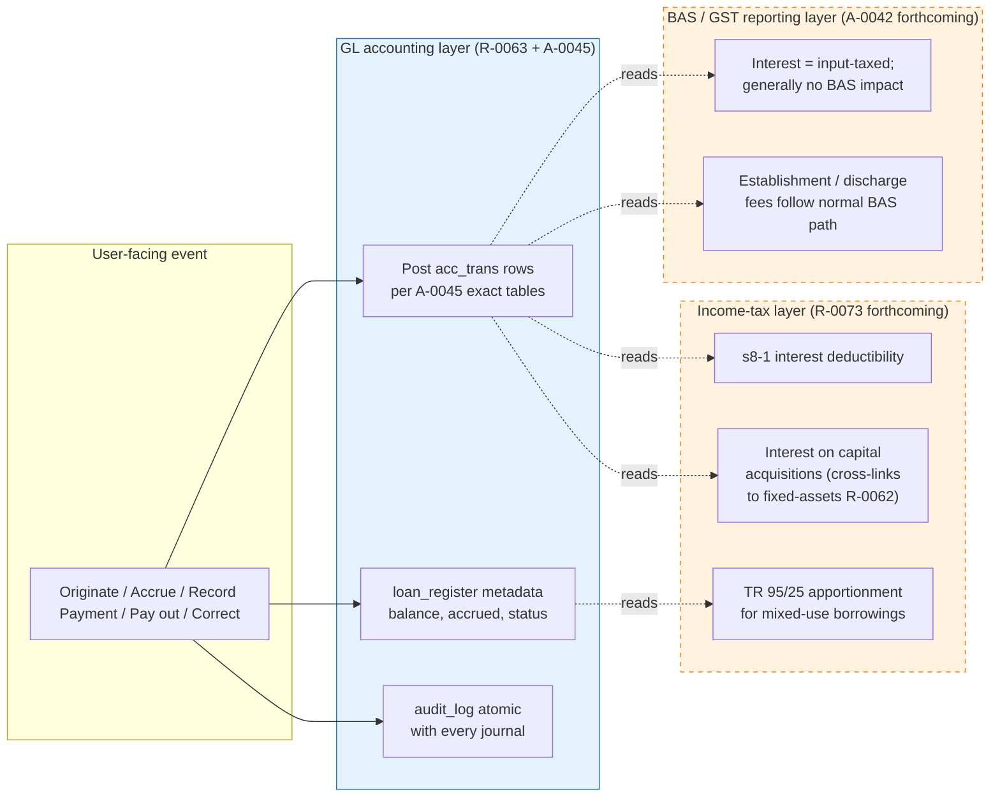
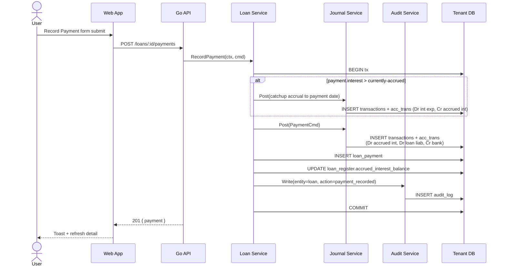
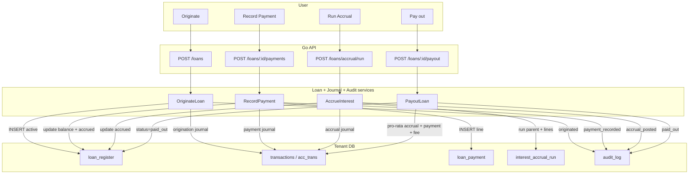

ID: R-0063
Title: Loan Management
Domain: Liabilities/Loans
Feature: loans
Status: Approved
Owner: Team Ledger
Created: 2026-04-17
Updated: 2026-04-22
Related Requirements:
  - R-0009
  - R-0029
  - R-0072 (forthcoming — Annual Estimate Review)
  - R-0073 (forthcoming — Tax Depreciation &amp; Disposal Layer; covers interest deductibility too)
Related Architecture:
  - A-0009
  - A-0012
  - A-0014
  - A-0044
  - A-0045
  - A-0042 (forthcoming — BAS Extraction Layer)
Related Tasks:
  - T-0034
  - T-0035
  - T-0036
  - T-0037
Related AI Guidance:
Related Policies:
  - P-0001
  - P-0007
  - P-0008
Impacted Repositories:
  - ledgius-api
  - ledgius-web-app
  - ledgius-db
  - ledgius-specs
Supersedes:
Superseded By:

# Summary

A focused loan management module providing a register, interest accrual, payment recording, and payout functionality for business loans within Ledgius. Every loan event posts a real double-entry journal, writes an audit row, and is reversible only via compensating entries — the ledger remains append-only per A-0009.

Loans are materialised as rows in a dedicated `loan_register` table that carries the repayment metadata and the current principal balance. All monetary truth still derives from `acc_trans` / `transactions`; `loan_register` is a lens + driver for the posting engine.

## Three-layer architecture

This feature writes the **GL accounting layer** only. Two adjacent layers read from the GL to produce their outputs and are specified separately:

- **BAS / GST reporting layer** (forthcoming **A-0042**) — handles the narrow BAS surface for loan events. Interest on most Australian business loans is an **input-taxed** supply (s40-5 ITAA), so the interest leg generally does not flow to G10/G11/1A/1B. Loan establishment fees and early-termination fees may carry GST depending on the lender — those follow the normal BAS-extraction path. BAS labels are **not** tagged on `acc_trans`.
- **Income-tax layer** (forthcoming **R-0073**) — determines interest deductibility under **s8-1 ITAA 1997** (interest on business borrowings), apportionment where borrowings are mixed-use (per **TR 95/25**), and interest-capitalisation rules for certain asset purchases. The accounting journals produced here are the input; R-0073 does not overwrite them.

# Problem / Business Context

Australian SMBs commonly carry multiple financing arrangements: bank term loans, chattel mortgages (equipment + vehicle finance), business lines of credit, and related-party loans. Without structured loan tracking:

- Interest expense is miscategorised or missed, understating tax deductions and overstating profit.
- Loan balances drift from actual lender statements — reconciliation becomes manual.
- Principal vs interest split is done in spreadsheets — error-prone and invisible to the ledger.
- BAS interest treatment (input-taxed) and tax-time deductibility (s8-1) have no audit trail if interest is lumped under "Bank Fees".
- Balance sheet liability positions are wrong.

The MYOB AO test fixture (M Bush & Y Laophanna) shows 4 chattel mortgages (Jeep, Toro, Hino, Kobelco) and 2 term loans — a common trades-business pattern.

# Scope

- **Register**: list view of all loans (active, paid-out, written-off) with balance, rate, next payment due, monthly obligation.
- **Detail**: per-loan page showing summary, repayment schedule (projected), payment history, accrued-interest position, audit timeline.
- **Origination**: record the initial drawdown — credit loan liability, debit the bank / asset account depending on use of funds.
- **Interest accrual**: periodic (monthly by default) accrual of interest — debit interest expense, credit accrued interest payable. Preview, idempotent run, reversible (see T-0037).
- **Payment**: split each payment into principal (reduces liability) and interest (clears accrued-interest payable or debits interest expense on cash basis). Posts both legs atomically.
- **Payout**: final settlement — pro-rata interest for the partial period + principal close-out + optional early-termination fee.
- **Correction paths (AASB 108)**: four distinct commands mirroring R-0062 AST-015..AST-015c — clerical edit, same-period reclass, prospective change of rate/term, prior-period restatement.

# Out of Scope

## Owned by other (forthcoming) specs — not in this requirement

- **Interest deductibility under s8-1 ITAA 1997** — owned by R-0073's tax layer. Apportionment of mixed-use borrowings (TR 95/25), non-deductible interest on private-portion borrowings, and the capital-acquisition interest rules all live there.
- **Annual estimate review (rate / term review)** — owned by R-0072. Uses the `ChangeLoanEstimate` command (see AST-style LN-015b) as its backend entrypoint.
- **BAS treatment of establishment / discharge fees** — owned by A-0042.

## Owned by other modules when built

- **Division 7A loans (from a company to a shareholder or associate)** — different regime with minimum-yearly-repayment rules, deemed-dividend risk. Belongs to a dedicated Div 7A module.
- **FBT loan fringe benefits (employee loans at below-market rates)** — belongs to the future FBT/payroll module.
- **Lease liabilities under AASB 16** — different recognition and measurement (right-of-use asset + lease liability; rent is split into finance cost + principal). Belongs to a dedicated leases module; not conflated here.

## Genuinely out of scope

- Loan **origination** workflow (application, credit check, approval) — Ledgius records a booked loan, not the acquisition process.
- Amortisation-schedule generation at origination time (future enhancement — computed on the fly in v1).
- Variable-rate adjustments mid-term (handled via `ChangeLoanEstimate` prospective update).
- Loan refinancing as a separate event — treated as payout of the old loan + origination of the new loan.
- Line-of-credit draw-down history and revolver balance — requires a separate "credit facility" model.
- Foreign-currency loans (assumed tenant base currency).
- Guarantees / personal security / covenants tracking.

# Actors / Users

- **Business Owner** — takes out loans, receives statements, approves payouts.
- **Bookkeeper** — records payments, reconciles loan balances against lender statements.
- **Accountant** — reviews interest expense, runs period-end accruals, verifies deductibility is appropriately tagged, approves prior-period corrections.

# Preconditions

- Chart of accounts includes:
  - Long-term liability accounts for loans (2-3xxx range) and a distinct account per loan **or** a single loan-control account with sub-ledger lens via `loan_register`.
  - Short-term / current-portion liability accounts if the tenant's reporting requires current/non-current split (optional — reported via a reclassification run at period end, future).
  - Accrued-interest-payable account (category L) — used when interest is accrued between payments under AASB 9 amortised-cost treatment.
  - Interest-expense account (category E) — per loan or shared.
  - Early-termination-fee expense account (category E).
- Bank account configured for payment source.
- Lender is a contact (`entity` / `entity_credit_account`, `entity_class=vendor`) so audit trail + payments flow through normal AP hygiene.
- Period-lock and BAS-lodgement tables populated so LN-016 / A-0044 I9 / A-0045 §10a can enforce locks.

# Functional Requirements

## Register

- **LN-001**: System shall maintain a loan register with: name, lender (entity FK), original amount, current principal balance, interest rate (annual %), compounding frequency, repayment frequency (weekly/fortnightly/monthly/quarterly), repayment amount, start date, maturity date, GL liability account, GL accrued-interest-payable account, GL interest-expense account, status, use-of-funds flag.
- **LN-002**: Use-of-funds flag enumerates `business` / `mixed` / `private` so the tax layer (R-0073) can apportion deductibility. Default is `business`; `mixed` requires a business-use percentage (0–100).
- **LN-002a**: Register list shall support filters: status (active / paid_out / written_off), lender, rate range, maturity within N months.
- **LN-002b**: Register header shall show totals: count active, total principal balance, total monthly/periodic obligation, total accrued interest outstanding.

## Detail

- **LN-003**: Loan Detail page `/loans/:id` displays: header (name, lender, status, rate, next payment due), summary (original, balance, accrued interest, monthly obligation, maturity), projected repayment schedule (computed from rate + amount + frequency), payment history, accrued-interest history, activity timeline from `audit_log`.
- **LN-003a**: Detail page exposes actions per state (A-0044 §3): Edit (non-posting fields always; posting-impacting fields via the correction commands in LN-015 family), Record Payment, Accrue Interest (manual run for this loan only), Payout, Write Off (admin).
- **LN-003b**: The "Record Payment" button launches `/loans/payments/new?loanId=:id` with the loan pre-selected. The "Payout" button launches `/loans/payout?loanId=:id`.

## Origination

- **LN-004**: System shall record the initial drawdown via `OriginateLoan` command per A-0045 §2:
  - Debit the receiving account (bank for cash proceeds; capital GL for asset-funded loans where the loan proceeds pay a supplier directly).
  - Credit the loan liability account (the full principal).
- **LN-004a**: For asset-funded drawdowns (the lender pays the supplier directly), the receiving account is the asset's capital account — see the bill-linked acquisition flow in R-0062 §AST-004a for the analogous pattern.
- **LN-004b**: Establishment fees are captured as a separate journal attached to the origination: debit Loan Establishment Fees (expense), credit Bank. If the lender amortises the fee into the effective interest rate, the tenant can elect to capitalise — but v1 defaults to expense-at-origination.
- **LN-004c**: Origination writes one audit row (`entity_type=loan`, `action=originated`, `entity_id={new loan id}`).

## Interest accrual

- **LN-005**: Interest accrual shall be computed per period using the current principal balance × annual rate × days / 365. Compounding is **simple** at the period level; ATO long-term-loan treatment aligns with simple daily accrual for tax purposes.
- **LN-005a**: Periodic accrual is **monthly** by default, anchored on calendar month-end in tenant timezone. Configurable per-tenant to daily in a later spec.
- **LN-005b**: Accrual run produces a single parent `transactions` per period (`type='interest_accrual_run'`) with one debit + credit pair per eligible loan: **Dr interest expense**, **Cr accrued interest payable**.
- **LN-005c**: Running accrual twice for the same period is blocked by a uniqueness constraint on `(tenant_id, period_end, status=posted)` — same pattern as R-0062 AST-006b. Preview may be re-run freely.
- **LN-005d**: An accrual run is reversible; reversal flips run status to `reversed` and writes compensating rows.
- **LN-005e**: Accrual runs are listed on the Loan Payments page (tab) and on the per-loan Detail page.

## Payment

- **LN-006**: Recording a loan payment shall split the total into principal and interest components. Split may be computed automatically (from current accrued interest + fixed repayment amount) or overridden by the user.
- **LN-006a**: Posting per A-0045 §4 (accrual-basis default): **Dr accrued interest payable** (up to the accrued balance), **Dr loan liability** (principal), **Cr bank**. If the user-entered interest amount exceeds the currently-accrued balance, the system posts a final "catch-up" interest accrual to the payment date **first**, then clears the accrued balance in the payment journal — all in one DB transaction.
- **LN-006b**: If the tenant elects cash-basis interest treatment (a per-tenant setting outside this requirement), interest is posted direct-to-expense on payment: **Dr loan liability** (principal), **Dr interest expense** (interest), **Cr bank**. No accrued-interest account is used; LN-005 accrual runs are skipped for that tenant.
- **LN-006c**: Payment may be less than the scheduled amount (part-payment) or more (lump-sum / prepayment). Any overpayment reduces principal first; if the overpayment exceeds the current principal balance + accrued interest, the command rejects with `ErrOverpayment`.
- **LN-006d**: Payment list shall show: date, loan name, principal amount, interest amount, total payment, balance after payment, linked bank transaction. Sortable by date; filterable by loan.
- **LN-006e**: Each payment writes an audit row with the split.

## Payout

- **LN-007**: Loan payout shall close the loan with a final payment. The command:
  - Posts a final pro-rata interest accrual from the last posted accrual to the payout date (same transaction).
  - Posts the payment journal clearing the remaining principal + the newly accrued interest.
  - Posts an early-termination-fee journal if a fee is supplied: **Dr Termination Fee Expense**, **Cr bank**.
  - Updates `loan_register.status='paid_out'` and sets `payout_date`, `payout_transaction_id`.
- **LN-007a**: Payout form shall show: current principal balance, accrued interest to payout date (computed live), optional termination fee, total cash outlay, and an estimated "savings vs completing the original term" indicator (for user decision support only — not a journal entry).
- **LN-007b**: Payout transitions loan to state `paid_out`. Row retained for audit; list views filter by default with an opt-in toggle to show.
- **LN-007c**: Payout writes one audit row (`action=paid_out`, payload includes principal cleared, interest, fee).

## Correction paths (AASB 108)

Four distinct pathways per A-0044 §3 and A-0045 §8.

- **LN-015**: **Clerical edit (no GL).** Name, description, notes. In-place, one audit row. Corresponds to `EditLoanNonPosting`.
- **LN-015a**: **Same-period reclassification.** Open-period reverse + repost for posting-impacting fields (lender account, liability account). Rejected if the target period is locked/BAS-lodged. Corresponds to `ReclassifyCurrentPeriod`.
- **LN-015b**: **Prospective rate / term change.** Mid-term rate adjustment (variable-rate movement) or term extension. AASB 108 estimate change — prospective only; no reversal of past interest. Appends to `loan.estimate_changes[]`; future accrual runs + payment splits use the new rate. Corresponds to `ChangeLoanEstimate`.
- **LN-015c**: **Prior-period restatement.** Material error in a closed or BAS-lodged period (e.g. interest misposted for several months). Posts current-period correction rows with `restatement_id`; P&amp;L portion routes to Retained Earnings (Opening). Requires `admin:restate_prior_period` permission. Corresponds to `RestatePriorPeriod`.

## Write-off

- **LN-008**: Write-off of an uncollectable loan (bad-debt scenario when *we* are the creditor — rare) or default forgiveness (when we are the debtor and the lender forgives the debt) is handled via `WriteOffLoan`. Loan moves to `written_off` state.
- **LN-008a**: For a loan *we owe* that is forgiven: **Dr loan liability** (clear remaining principal), **Dr accrued interest payable** (clear remaining accrued), **Cr Other Income — Debt Forgiven** (`reporting_category='other_income'` per AASB 116 §68 analogue — not operating revenue). Tax treatment (assessability of forgiven debt) is owned by R-0073.

## Closed-period &amp; BAS-lodgement locks

- **LN-016**: Any command that creates, modifies, or reverses GL rows in a locked/BAS-lodged period is rejected with `ErrPeriodLocked`. Applies to `OriginateLoan`, `AccrueInterest`, `RecordPayment`, `PayoutLoan`, `ReversePayment`, `ReverseAccrualRun`, `ReclassifyCurrentPeriod`, `WriteOffLoan`.
- **LN-016a**: The only exception is `RestatePriorPeriod`, which posts current-period correction rows tagged `restatement_id`.

## Help &amp; policy wiring (non-negotiable)

Per A-0014 §5c. Every page added by this feature MUST wire `usePageHelp` + `usePagePolicies`.

- **LN-017**: Required help YAML files under `src/locales/en-AU/help/liabilities/`:

  | Page | Slug / YAML | T-00xx owner |
  |---|---|---|
  | Loan Register (`/loans`) | `loanRegister.yaml` | T-0034 |
  | Loan Detail (`/loans/:id`) | `loanDetail.yaml` | T-0034 |
  | Loan Payments (`/loans/payments`) | `loanPayments.yaml` | T-0035 |
  | Record Payment (`/loans/payments/new`) | `recordPayment.yaml` | T-0035 |
  | Loan Payout (`/loans/payout`) | `loanPayout.yaml` | T-0036 |

- **LN-017a**: Every page registers `usePagePolicies(["account", "tax", "liabilities"])` at minimum. Per-page additions may include `capital` on Loan Payout (early-termination-fee accounting) and `interest` on Loan Payments.

- **LN-017b**: Mandatory help sections per page:
  - **Loan Register**: What a loan is · How interest accrual differs from payments · When to pay out early · Use-of-funds and deductibility pointer · Annual estimate review reminder.
  - **Loan Detail**: Status meanings · Four AASB 108 correction paths · Reading the repayment projection vs actual · Accounting vs tax interest.
  - **Loan Payments**: Principal/interest split rules · Cash-basis vs accrual-basis tenants · Part-payments + prepayments · What happens to overpayments.
  - **Record Payment**: Required fields · Split calculation preview · When to override the split · Locked-period check.
  - **Loan Payout**: Pro-rata interest explanation · Termination fee accounting · Savings calc is informational only (not a journal entry) · BAS treatment (interest input-taxed; fee may carry GST).

# Data / Entities / Fields

## Existing tables leveraged

| Table | Role |
|---|---|
| `account` | Liability accounts (category L) for loan principal + accrued-interest-payable; expense accounts (category E) for interest expense + termination fee; other income (category I) for debt forgiveness. |
| `acc_trans` | Individual debit/credit rows for every origination, accrual, payment, payout, write-off. |
| `transactions` | Parent transaction for each loan event. |
| `audit_log` | Mandatory audit row per loan mutation. |
| `entity_credit_account` | Lender contact (vendor class). |

## New tables

| Table | Role |
|---|---|
| `loan_register` | Primary metadata: name, description, lender_eca_id, original_amount, current_balance (stored; set by OriginateLoan to `original_amount` and maintained by RecordPayment / ReversePayment / PayoutLoan / WriteOffLoan), interest_rate_annual_pct, compounding_frequency, repayment_frequency, repayment_amount, start_date, maturity_date, use_of_funds, business_use_pct, accrued_interest_balance, liability_account_id, accrued_interest_account_id, interest_expense_account_id, status (no DB default — service must set on INSERT; a reconciliation job verifies the stored balances against the ledger sums nightly), estimate_changes JSONB, correction_id, origination_transaction_id, payout_transaction_id, payout_date, written_off_transaction_id, written_off_date. |
| `loan_payment` | Per-payment record: loan_id, payment_date, principal_amount, interest_amount, total_amount, balance_after, bank_account_id, transaction_id (parent), reversed_transaction_id (nullable — set on reversal). |
| `interest_accrual_run` | Period run: period_start, period_end, status (preview/posted/reversed), total_accrued, parent_transaction_id, posted_by, posted_at. |
| `interest_accrual_run_line` | Per-loan line in a run: run_id, loan_id, amount, balance_at_period_start, days_in_period. |

Schema details live in T-0034 / T-0035 / T-0036 / T-0037.

# UX / UI Behaviour

See A-0014 UX principles and LN-017 for help/policy wiring.

- **LN-020**: Loan Register page displays all loans with filters + header totals. Row click opens `/loans/:id`.
- **LN-021**: Loan Detail page is the hub for per-loan actions (Edit, Record Payment, Accrue Interest, Payout, Write Off). State-gated per A-0044 §6.
- **LN-022**: Loan Payments page shows a payments list with filter + "Record Payment" action. Payment rows click through to the parent journal.
- **LN-023**: Record Payment form pre-calculates the principal/interest split based on current accrued balance + scheduled repayment. User can override either side; the other auto-adjusts to match the total.
- **LN-024**: Loan Payout form shows live pro-rata interest as the user enters the payout date. Preview shows the exact journal rows before submit.
- **LN-025**: Every page shows an InfoPanel with a distinct `storageKey`. Action buttons live in the page header per A-0014.

# Validation Rules

- Original amount > 0.
- Interest rate ≥ 0% (0% allowed for interest-free related-party loans).
- Repayment amount ≥ 0 (can be zero for revolving/interest-only facilities — out of scope for v1 core but reserved).
- Maturity date > start date.
- Payment amount > 0 and ≤ (current_balance + accrued_interest).
- Payout date ≥ start_date and ≥ last accrual posted-through date.
- Early termination fee ≥ 0.
- Business-use % in [0, 100] (required when `use_of_funds='mixed'`).
- Period lock: enforced per LN-016 on every GL-writing command.

# Security / Permissions

Per R-0041 feature + per-role function permissions:

- Feature: `loans` (plan-gated).
- Functions:
  - `loans:view` — Bookkeeper, Accountant, Owner, Master Accountant, Viewer.
  - `loans:create` — Bookkeeper, Accountant, Owner, Master Accountant. Gates `OriginateLoan`.
  - `loans:edit` — Bookkeeper, Accountant, Owner, Master Accountant. Gates `EditLoanNonPosting`.
  - `loans:record_payment` — Bookkeeper, Accountant, Owner, Master Accountant.
  - `loans:run_accrual` — Accountant, Owner, Master Accountant.
  - `loans:reverse_accrual` — Accountant, Master Accountant only.
  - `loans:payout` — Accountant, Owner, Master Accountant.
  - `loans:write_off` — Master Accountant only (material event; higher bar).
  - `loans:correct` — Accountant, Master Accountant. Gates `ReclassifyCurrentPeriod` + `ChangeLoanEstimate`.
  - `admin:restate_prior_period` — Master Accountant only. Combined with `loans:correct` to gate `RestatePriorPeriod`.

# Acceptance Criteria

## GL &amp; data

- [ ] Loan register lists all loans with current balances and header totals.
- [ ] Loan detail page shows summary, schedule, payment history, accrual history, timeline, and action buttons per A-0044 §6.
- [ ] `OriginateLoan` posts the GL pair per A-0045 §2; audit row written.
- [ ] `AccrueInterest` posts a run per A-0045 §3; idempotent per period; reversible; each line carries `loan_id` + `run_id` tags.
- [ ] `RecordPayment` posts the three-leg (or two-leg cash-basis) journal per A-0045 §4; clears accrued balance correctly; audit row written.
- [ ] `PayoutLoan` posts pro-rata accrual + payment + optional fee in one tx; loan transitions to `paid_out`.
- [ ] `WriteOffLoan` posts the debt-forgiven journal with `reporting_category='other_income'` account mapping.
- [ ] Ledger invariant test across the full lifecycle: `sum(debits) == sum(credits)` on every journal; `loan.current_balance = loan.original_amount − sum(principal_payments)`; `loan.accrued_interest_balance = sum(accruals) − sum(interest_portion_of_payments)`.
- [ ] Permission tests: each function enforced per role; `RestatePriorPeriod` requires both `loans:correct` and `admin:restate_prior_period`.

## Correction paths (LN-015 family)

- [ ] `EditLoanNonPosting` writes `edited` audit row only — no `acc_trans` rows.
- [ ] `ReclassifyCurrentPeriod` reverses+reposts in same tx; rejected when target period is locked.
- [ ] `ChangeLoanEstimate` writes `estimate_changed` audit row only; subsequent accrual + payment splits use new rate/term.
- [ ] `RestatePriorPeriod` posts current-period correction rows with `restatement_id`; P&amp;L portion routes to Retained Earnings (Opening).

## Period locks (LN-016)

- [ ] All GL-writing commands reject with `ErrPeriodLocked` when target period is locked or BAS-lodged; `RestatePriorPeriod` is the only exception.

## Help &amp; policy (LN-017)

- [ ] Every loans page (`/loans`, `/loans/:id`, `/loans/payments`, `/loans/payments/new`, `/loans/payout`) calls `usePageHelp(...)` and `usePagePolicies(["account","tax","liabilities"])`.
- [ ] All five help YAML files ship with the mandatory sections from LN-017b.
- [ ] Reviewer rejects any new loans page without both hooks.

## Scope boundaries

- [ ] No `bas_label` tags on any GL row — BAS derivation is A-0042's job.
- [ ] Interest expense rows carry a `use_of_funds` tag pulled from the loan (business/mixed/private); R-0073's tax layer reads this to compute deductibility. The accounting journal is unconditional — business deductibility is not pre-filtered at posting time.
- [ ] T-0036 (payout) + T-0035 (payment) implementation PRs reference R-0073 as an approved spec and call its tax-layer hook (or documented stub).

# Data Flow Overview

Three diagrams: layer separation, a payment sequence showing the backend path, and a full lifecycle flow.

## Layer separation

## Payment sequence (accrual-basis tenant)

## Lifecycle data flow

# Related Documents

## In this PR

- A-0044 — Loan Lifecycle &amp; State Machine (companion).
- A-0045 — Loan GL Posting Contract (companion).
- T-0034 through T-0037 — implementation plans.
- `openapi-loans.yaml` — endpoint contract.

## Adjacent (forthcoming) specs

- **A-0042** — BAS Extraction Layer. Handles BAS for fees associated with loan events.
- **R-0072** — Annual Estimate Review. Uses `ChangeLoanEstimate` (LN-015b) as its backend entrypoint for annual rate/term reviews.
- **R-0073** — Tax Layer. Owns s8-1 deductibility, TR 95/25 apportionment for mixed-use borrowings, Div 7A interactions, and assessability of forgiven debt.

## Foundation

- A-0009 — Ledger principles (immutability, atomicity, idempotency).
- A-0012 — Entity state machine pattern.
- A-0014 — UX principles (including §5c `usePageHelp` + `usePagePolicies` contract referenced by LN-017).

## Policy &amp; standards

- P-0001 — ATO record-keeping requirements.
- P-0007 — ITAA interest deductions.
- P-0008 — GST &amp; BAS reporting (including interest as input-taxed supply).
- AASB 9 — Financial Instruments: amortised-cost measurement of loans.
- AASB 108 — Accounting policies, changes in estimates, errors — underpins the four correction paths (LN-015 family).
- AASB 116 §68 (analogue) — debt forgiveness gain classification (other income, not operating revenue).
- ITAA 1997 s8-1 — general deductions for interest on business borrowings.
- ITAA 1997 s40-5 — input-taxed supplies (financial services).
- TR 95/25 — apportionment of interest on mixed-use borrowings.
- Division 7A ITAA 1936 — private-company loans to shareholders/associates (out of scope; flagged for future module).
