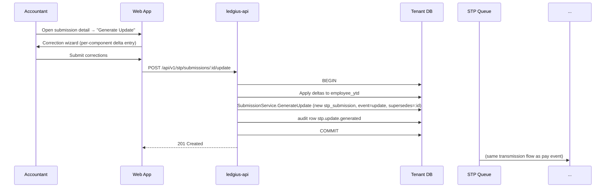

ID: A-0005
Title: Single Touch Payroll Phase 2 Reporting Architecture
Domain: Payroll/STP
Feature: stp-phase2-reporting
Status: Draft
Owner: Team Ledger
Created: 2026-04-28
Updated: 2026-04-28
Related Requirements:
  - R-0005
Related Architecture:
  - A-0009  (Ledger principles)
  - A-0048  (Money handling)
Related Tasks:
Related AI Guidance:
Impacted Repositories:
  - ledgius-api
  - ledgius-web-app
  - ledgius-db
Supersedes:
Superseded By:

# Summary

Architecture for STP Phase 2 reporting. Five cooperating components inside `ledgius-api`, one new schema area in `ledgius-db`, two new pages in `ledgius-web-app`, and an outbound dependency on a third-party SBR Intermediary (MessageXchange or Ozedi — selection deferred to a decision matrix in this document).

The architecture is structured around three facts:

1. **YTD is the unit of reporting**, not per-pay deltas. Every submission is a snapshot of per-employee totals as of the pay run's payment date. So a YTD aggregator that writes after every finalised pay run is the single source of truth — payload generation is a pure read of YTD plus tax-declaration-derived metadata.
2. **The Tax Treatment Code (TTC) is a decision table**, not procedural code. It maps `(tax-free-threshold, SSL/HELP, Medicare-Levy variation, foreign-resident, no-TFN, seniors, WHM-registered, actor/horticulturalist) → 6-char string`. Authored as a GoRules / CEL table, it can be updated as the ATO publishes new variants without a release.
3. **Direct ebMS3/AS4 self-certification is a multi-month effort** that v1 should not undertake. We integrate via an SBR intermediary that owns the certified transport and surfaces a JSON / SOAP wrapper. The architecture isolates the intermediary behind an interface so the direct-SBR path stays achievable post-v1.

# Terms

Vocabulary used in this spec (STP Phase 2, Pay Event, Update Event, Finalisation Event, Full File Replacement, Submission ID, BMS ID, Run Date/Time Stamp, YTD Totals, Tax Treatment Code, Income Type, Employment Basis, Disaggregated Gross, ECT, EVTE, SBR Intermediary) is defined canonically in **R-0005 §Terms**.

# Requirement Link

- R-0005 (STP Phase 2 Reporting) — paired requirement

# Technical Context

What already exists in the codebase that this architecture builds on or works around:

- **Pay run engine** (`ledgius-api/internal/payroll`) — produces finalised pay runs with `gross_pay`, `payg_withheld`, and `super_guarantee` per employee. Pay components are not yet disaggregated; pay-run service writes a single `gross_pay` line. STP requires disaggregation (gross / overtime / bonus / paid leave / allowances / lump sums / sacrifice). The pay-component refactor is a precondition, not part of this architecture, but the STP YTD aggregator's contract assumes it has landed.
- **GL posting** (`internal/journal`, `internal/payroll/service.go`) — pay runs already post balanced double-entry GL lines. STP YTD is **not** derived from GL; it is derived from pay-run components (pre-rounding, before tax deductions are split into liability/expense splits). YTD therefore lives in its own table, reconcilable to GL but not equal to it.
- **Audit log** (`internal/audit`) — every financial mutation already writes an `audit_log` row. STP submissions and EOFY finalisation reuse this path; STP submissions additionally maintain their own `stp_submission` immutable record because they carry too much payload to fit cleanly in the audit metadata column.
- **Rules engine** (`pkg/rules`, GoRules / CEL) — already in production for OPA-style policy checks (e.g. `ValidatePositiveAmount`). The TTC derivation table is a natural fit.
- **Multi-tenant DB connection** (`pkg/tenant.Manager.Resolve`) — STP entities are per-tenant; they live in the tenant DB, not the platform DB.
- **Money handling** (A-0048) — decimal precision, half-up banker's rounding. STP YTD aggregation uses this standard; reconciliation tolerance is `$0.00` for whole-cent amounts and `$0.01` for components subject to per-pay rounding (e.g. allowance × hours × rate).

What does **not** exist and is in scope:
- Any STP code in API or web app.
- A payload generator for PAYEVNT.0004.
- Any SBR or ebMS3 client.
- A YTD aggregator (the schema scaffold exists in `V1.28__stp_phase2.sql` but has no writers).
- A submission queue.
- A TTC derivation table.
- TFN / ABN checksum validators (the existing super-fund-ABN field is plain text).

# Proposed Design

## Component Overview

```
                 ledgius-api (per-tenant)
+---------------------------------------------------------------+
|                                                               |
|  payroll.Service.FinalisePayRun  ──────────────────┐          |
|                                                    │          |
|                                          stp.YTDAggregator    |
|                                                    │          |
|                              writes employee_ytd ──┘          |
|                                                               |
|  stp.SubmissionService                                        |
|    .GeneratePayEvent  (reads employee_ytd → builds payload)   |
|    .GenerateUpdate                                            |
|    .GenerateFFR                                               |
|    .GenerateFinalisation                                      |
|                                                               |
|        │ writes stp_submission (status=pending)               |
|        ▼                                                      |
|  stp.SubmissionQueue (background goroutine; cron-driven)      |
|        │                                                      |
|        ▼                                                      |
|  stp.IntermediaryClient   ◄── interface; impls:               |
|        │     ├─ MessageXchangeClient                          |
|        │     └─ OzediClient                                   |
|        │     └─ FakeClient (tests + EVTE replay)              |
|        ▼                                                      |
|  stp.ResponseHandler (writes stp_submission_attempt + status) |
|                                                               |
+───────────────────────────────────────────────────────────────+
                            │
                            ▼   HTTPS (mTLS)
                +───────────────────────────+
                │   SBR Intermediary        │
                │   (MessageXchange | Ozedi)│
                +───────────────────────────+
                            │
                            ▼   ebMS3 / AS4 (SBR)
                +───────────────────────────+
                │     ATO SBR Gateway       │
                +───────────────────────────+
```

## YTD Aggregator

**Location**: `ledgius-api/internal/stp/aggregator/aggregator.go`

**Trigger**: invoked synchronously inside `payroll.Service.FinalisePayRun`, in the same DB transaction as GL posting and audit-log write. If aggregation fails, the entire pay-run finalisation rolls back. This guarantees YTD never diverges from finalised pay runs.

```go
type YTDAggregator struct {
    repo       *Repository       // reads/writes employee_ytd
    payrollRepo *payroll.Repository
    audit      *audit.Repository
}

// Aggregate reads the finalised pay run, computes the per-component delta
// for each payee, and applies it to employee_ytd. Idempotent on the
// (pay_run_id, employee_id) key — re-running with the same pay_run_id is
// a no-op (idempotency token persisted on employee_ytd_application).
func (a *YTDAggregator) Aggregate(ctx context.Context, payRunID int) error
```

**Reconciliation invariant**: for any (employee, financial_year), `employee_ytd.<component>` == `Σ pay_run_lines.<component>` for finalised pay runs in that year, plus `employee_ytd_opening.<component>`. A reconciliation read-model recomputes this on demand for the submission-blocking check (PAY-STP-030); any divergence beyond `$0.01` per component is a fatal pre-flight error.

## Submission Service

**Location**: `ledgius-api/internal/stp/submission/service.go`

Four entry points:

```go
type Service struct {
    repo       *Repository           // stp_submission, stp_submission_attempt
    ytdRepo    *ytd.Repository
    employerRepo *employer.Repository
    ttcResolver  *ttc.Resolver        // GoRules table
    schemaValidator SchemaValidator   // PAYEVNT.0004 XSD
    audit       *audit.Repository
    queue       *Queue
}

func (s *Service) GeneratePayEvent(ctx, payRunID) (*Submission, error)
func (s *Service) GenerateUpdate(ctx, employeeID, financialYear, deltas) (*Submission, error)
func (s *Service) GenerateFFR(ctx, originalSubmissionID, correctedPayload) (*Submission, error)
func (s *Service) GenerateFinalisation(ctx, financialYear, employeeIDs) (*Submission, error)
```

Each entry point follows the same shape:

1. Open DB transaction.
2. Read YTD + employer config + employee tax declarations.
3. Resolve TTC via the GoRules table.
4. Build the PAYEVNT.0004 payload (see §Payload Generator).
5. Validate payload against the schema (XSD or JSON Schema, depending on intermediary envelope).
6. Persist `stp_submission` row with `status='pending'`, deterministic `submission_id` (UUIDv7).
7. Write audit-log row (`stp.<event_type>.generated`).
8. Commit.
9. Hand the submission ID to the queue (best-effort enqueue; the cron picks up `pending` rows regardless).

## Payload Generator

**Location**: `ledgius-api/internal/stp/payload/generator.go`

Pure function: `(YTDSnapshot, EmployerConfig, []EmployeePayload, EventType, RunDateTime) → PAYEVNTDocument`. No DB access, no I/O. Trivial to unit-test and to replay against the ATO ECT sample test cases.

The generator emits the structure mandated by PAYEVNT.0004:

```
PAYEVNT
├── Header
│   ├── BMSVendor
│   ├── BMSName
│   ├── BMSID
│   ├── ProductID
│   ├── SubmissionID
│   ├── RunDateTimeStamp
│   └── EventType (submit | update | replace | finalisation)
├── Payer
│   ├── ABN, Branch
│   ├── Contact (name, email, phone)
│   ├── Address
│   └── PayerEmail (ECTTEST@ect.ato in ECT mode)
├── PayeeRecord[]    (one per employee in scope)
│   ├── PayeeIdentity
│   │   ├── TFN (encrypted in storage; cleartext in payload to ATO)
│   │   ├── Surname, GivenName, OtherGivenName
│   │   ├── DateOfBirth
│   │   ├── Address (Line1, Line2 — TestCaseNN.xx in ECT mode, Suburb, State, Postcode, Country)
│   │   ├── PayrollID
│   │   ├── PreviousPayrollID
│   │   ├── PreviousBMSID
│   │   ├── IncomeType
│   │   ├── EmploymentBasis
│   │   ├── CountryCode (IAA / WHM only)
│   │   └── TaxTreatmentCode
│   ├── PayeePeriod
│   │   ├── PayPeriodStart, PayPeriodEnd
│   │   └── PayDate (PAYEVNT69)
│   └── PayeeYTD
│       ├── Gross
│       ├── Overtime, Bonus, DirectorsFees
│       ├── PaidLeave[] (sub-code + amount)
│       ├── Allowance[] (type-code + amount + description?)
│       ├── LumpSum (A_R, A_T, B, D, E, W)
│       ├── ETP[] (type + amount)
│       ├── DeathBenefit[] (relationship + amount)
│       ├── ForeignIncome (country, foreign-tax-paid, exempt, assessable)
│       ├── Deduction[] (F, W, G, D)
│       ├── PAYGWithheld
│       ├── SuperGuarantee
│       └── RESC[] (S, O)
└── PayerTotals (sums across PayeeRecord[])
```

The generator's output is deterministic given the same inputs — required because the same submission may be re-emitted on retry and must be byte-identical (per PAY-STP-009).

## Tax Treatment Code Decision Table

**Location**: `ledgius-api/internal/stp/ttc/rules.cel` (GoRules / CEL bundle).

The TTC is `<Category><Sub1><Sub2><Sub3><Sub4><Sub5>` (6 chars). The decision-table inputs:

| Input | Source |
|---|---|
| `category` | derived from income_type + (foreign-resident? + actor? + horticulturalist? + WHM-registered? + seniors? + death-beneficiary? + voluntary-agreement?) |
| `tax_free_threshold_claimed` | tax_declaration |
| `ssl_help_combined` | tax_declaration (study-and-training-support-loan flag) |
| `medicare_levy_variation` | enum(`none`, `reduction_full`, `reduction_half`, `exemption_full`, `exemption_half`, `surcharge_t1`, `surcharge_t2`, `surcharge_t3`) |
| `spouse_indicator` | tax_declaration |
| `dependants_count` | tax_declaration |
| `tfn_status` | enum(`provided`, `applied_within_28d`, `exempt_pensioner`, `exempt_under_18`, `none_after_28d`) |

The decision table emits the TTC string. Re-derivation triggers:
- on tax-declaration save,
- on the 28th day after `no_tfn_28day_started_at` (cron),
- on income-type or foreign-resident change.

Cached on `employee.tax_treatment_code`; used at payload generation. The full table is large but bounded — the intent is to express it once and exhaustively rather than as scattered conditionals across the codebase.

## SBR Intermediary Client

**Location**: `ledgius-api/internal/stp/transport/`

Interface:

```go
type IntermediaryClient interface {
    Submit(ctx context.Context, env Envelope) (TransportResult, error)
    PollResponse(ctx context.Context, transportID string) (*ATOResponse, error)
    Capabilities() Capabilities  // does it auto-poll, or do we?
}

type Envelope struct {
    SubmissionID string  // our UUID, mirrored back in response
    EventType    string
    Payload      []byte  // signed PAYEVNT.0004 XML
    Idempotent   bool
}

type TransportResult struct {
    TransportID string  // intermediary's ID for this transmission
    AcceptedAt  time.Time
    PendingPoll bool    // if true, response not synchronously available
}

type ATOResponse struct {
    SubmissionID  string
    ReceiptID     string
    Outcome       string  // accepted | warning | rejected | error
    ErrorCodes    []string
    RawPayload    []byte
}
```

Two implementations ship: `MessageXchangeClient` and `OzediClient`. Selection is per-tenant (`stp_employer_config.intermediary`) with the platform-default settable via env var. A `FakeClient` returns canned responses for unit tests and for ECT-replay-mode (replays a captured EVTE response without actually transmitting — useful for developing against the test suite offline).

### Decision Matrix — MessageXchange vs Ozedi

Both candidates are SBR-certified intermediaries used by Australian payroll vendors. Selection criteria:

| Criterion | Weight | MessageXchange | Ozedi | Notes |
|---|---|---|---|---|
| Per-submission cost (low volume, ~50 employees) | 3 | TBC — published from $0.10/submission | TBC — published from $0.08/submission | Order-of-magnitude only; both negotiate volume tiers. Confirm via sales contact. |
| Per-submission cost (mid volume, ~1,000 employees / fortnight) | 3 | TBC | TBC | Same caveat. |
| Onboarding lead time | 2 | ~2 weeks (commercial agreement + sandbox creds) | ~2 weeks | Comparable. |
| Sandbox quality (EVTE replay, error injection) | 4 | TBC — has explicit ECT-replay mode | TBC — has explicit ECT-replay mode | Hands-on evaluation needed before commit. |
| API ergonomics (REST/JSON wrapper vs SOAP) | 3 | REST + JSON | REST + JSON (also SOAP available) | Both acceptable. |
| Response polling vs callback | 2 | Both — webhook preferred | Polling default; webhook on request | Webhook avoids the cron polling loop. |
| Direct-SBR migration runway | 3 | Provides ebMS3 transport library separately | No direct-SBR pathway documented | MessageXchange wins if we plan to internalise transport later. |
| Australian support hours / response SLA | 2 | TBC | TBC | Both Australian-headquartered. |
| Existing accounting-vendor reference customers | 2 | Xero, MYOB historical | Reckon, Cashflow Manager | Both are credible. |
| Data residency (AU-only) | 5 | AU-only | AU-only | Mandatory; both compliant. |
| Contract flexibility (month-to-month vs annual) | 2 | TBC | TBC | Confirm at sales. |

**Scoring approach**: validate the TBCs by holding a 30-min call with each vendor's sales engineer, then run a 1-week hands-on EVTE evaluation against both sandboxes using the same `FakeClient`-shaped contract. The scoring spreadsheet is owned by Team Ledger; final selection produces a follow-up A-0005 update (Status: In Progress) committing the choice.

**Default if unscored at implementation start**: ship the `IntermediaryClient` interface and the `FakeClient` first; both production clients can be added in parallel during evaluation. The interface shape is intentionally vendor-neutral so the choice is reversible during implementation.

**Direct SBR option**: explicitly out of scope for v1 (per R-0005 §Out of Scope). The interface is preserved so a third implementation `DirectSBRClient` (operating ebMS3/AS4 in-process via a library like jbx or sbr-au) can be added later without touching the upstream submission service.

## Submission Queue

**Location**: `ledgius-api/internal/stp/queue/queue.go`

The queue is a database-backed cron, not an external broker. Justification: STP submission rate is low (≤ tens per day per tenant), latency tolerance is high (minutes, not seconds), and we want all retries reasoned about against the same `stp_submission` row. Adding a Redis/SQS dependency would buy nothing.

Cron loop, scheduled every 30 s per tenant:

```
for submission in stp_submission where status in ('pending', 'submitting') and next_attempt_at <= now():
    submission.status = 'submitting'
    attempt = stp_submission_attempt.create(submission_id, attempt_no = submission.attempt_count+1)
    try:
        result = intermediary.Submit(envelope)
        attempt.transport_status = 'accepted'
        if intermediary.Capabilities().AutoPolls:
            submission.status = 'submitted'
            submission.next_attempt_at = null
        else:
            submission.status = 'submitted'
            submission.next_attempt_at = now() + 60s   # poll cadence
    except retryable_error:
        submission.attempt_count += 1
        submission.next_attempt_at = now() + backoff(attempt_count)
        submission.status = 'pending'
        attempt.transport_status = 'transient_failure'
    except permanent_error:
        submission.status = 'error'
        attempt.transport_status = 'permanent_failure'
```

Backoff: `min(30s × 2^(attempt-1), 60min)` with full jitter. Maximum attempts: 24 over ~1 day. After max attempts → `status='error'` requiring operator action.

A separate poll loop handles `submitted` rows: calls `intermediary.PollResponse`; on result writes `stp_submission_attempt.ato_response_payload` + flips status to `accepted` / `warning` / `rejected`.

## Status UI (web app)

**Location**: `ledgius-web-app/src/pages/payroll/stp/`

Three pages:

1. **`SubmissionsListPage.tsx`** — paginated list of `stp_submission` per tenant. Columns: payment date, event type, financial year, status pill, receipt ID, attempts, last error. Filter + search.
2. **`SubmissionDetailPage.tsx`** — full payload (expandable JSON view + raw XML view), ATO response (parsed + raw), per-attempt transport history. Action buttons: "Retry" (transport-level), "Generate Update" (opens correction wizard), "Full File Replace" (gated modal).
3. **`EmployerConfigPage.tsx`** — ABN, Branch, BMS Vendor, BMS Name, contact, address, intermediary selection. Read-only display of BMS ID, Product ID. Inline ABN validation.

A fourth page lives elsewhere:

4. **`EmployeeTaxDeclarationPage.tsx`** — extends the existing employee edit flow. Captures the source fields for TTC derivation; re-derives and live-displays the TTC as the user types.

EOFY workflow uses an existing payroll page; the finalisation action is a new button + confirmation modal there rather than a new page.

# Affected Components

| Repo | Path | Change |
|---|---|---|
| `ledgius-db` | `migrations/tenant/V1.<NN>__stp_phase2_writers.sql` | Add `employee_ytd_opening`, `stp_submission_attempt`, `stp_report_calendar`, `stp_test_case_run`. Extend `employee_ytd` columns. Extend `employee` (income_type, employment_basis, country_code, payroll_id, previous_payroll_id, tfn_encrypted, tfn_supplied_at, no_tfn_28day_started_at, tax_treatment_code, tax_declaration). Extend `stp_employer_config` (BMS Vendor, BMS Name, BMS ID, Product ID, intermediary, contact, address, ECT-mode flag). Add unique index on `stp_submission(submission_id)`. |
| `ledgius-api` | `internal/stp/aggregator/` | New. YTD aggregator. |
| `ledgius-api` | `internal/stp/submission/` | New. Submission service. |
| `ledgius-api` | `internal/stp/payload/` | New. PAYEVNT.0004 generator. |
| `ledgius-api` | `internal/stp/ttc/` | New. TTC resolver + GoRules bundle. |
| `ledgius-api` | `internal/stp/transport/` | New. IntermediaryClient interface + impls. |
| `ledgius-api` | `internal/stp/queue/` | New. Submission queue cron. |
| `ledgius-api` | `internal/payroll/service.go` | Modify `FinalisePayRun` to invoke `YTDAggregator.Aggregate` and `Service.GeneratePayEvent` inside the same tx. |
| `ledgius-api` | `pkg/validation/` | New. TFN mod-11 + ABN mod-89 validators (used by employee + employer + super-fund forms + payload validators). |
| `ledgius-api` | `cmd/server/main.go` | Wire up the STP services + cron. |
| `ledgius-web-app` | `src/pages/payroll/stp/` | New. Submission list, detail, employer config. |
| `ledgius-web-app` | `src/pages/payroll/employees/` | Extend with tax-declaration capture + live TTC display. |
| `ledgius-web-app` | `src/pages/payroll/eofy/` | New. EOFY finalisation workflow. |

# Data Flow

## Pay run → STP Pay Event (happy path)

```mermaid
sequenceDiagram
    participant U as User (Bookkeeper)
    participant W as Web App
    participant API as ledgius-api
    participant DB as Tenant DB
    participant Q as STP Queue
    participant I as Intermediary
    participant ATO as SBR / ATO

    U->>W: Click "Finalise pay run"
    W->>API: POST /api/v1/pay-runs/:id/finalise
    API->>DB: BEGIN
    API->>DB: pay run lines + GL + audit row
    API->>DB: YTDAggregator.Aggregate (writes employee_ytd)
    API->>DB: SubmissionService.GeneratePayEvent (writes stp_submission, status=pending)
    API->>DB: COMMIT
    API-->>W: 201 Created (pay-run + pending submission)
    W-->>U: Pay run finalised; STP queued
    Q->>DB: SELECT pending stp_submission
    Q->>I: Submit envelope
    I->>ATO: ebMS3 PAYEVNT.0004
    ATO-->>I: Receipt
    Q->>DB: stp_submission status=submitted, attempt row written
    Q->>I: PollResponse
    I-->>Q: ATOResponse (accepted, receipt_id)
    Q->>DB: stp_submission status=accepted, response stored
```

## Update Event (retrospective correction)



# API / Interface Changes

New endpoints under `/api/v1/stp/`:

| Method | Path | Purpose | Min role |
|---|---|---|---|
| GET | `/api/v1/stp/submissions` | List submissions (filter by status / event-type / FY) | Bookkeeper |
| GET | `/api/v1/stp/submissions/:id` | Submission detail incl. payload + response + attempts | Bookkeeper |
| POST | `/api/v1/stp/submissions/:id/retry` | Force a queue-driven re-attempt of a `pending` / `error` submission | Bookkeeper |
| POST | `/api/v1/stp/submissions/:id/update` | Generate an Update Event derived from a prior submission | Accountant |
| POST | `/api/v1/stp/submissions/:id/replace` | Generate a Full File Replacement | Accountant or Owner |
| POST | `/api/v1/stp/finalisations` | Generate EOFY finalisation submissions for a list of employees | Owner or Accountant |
| GET | `/api/v1/stp/employer-config` | Read employer STP config | Bookkeeper |
| PUT | `/api/v1/stp/employer-config` | Update employer STP config | Owner |
| GET | `/api/v1/stp/employees/:id/ytd` | Per-employee YTD snapshot | Bookkeeper |
| GET | `/api/v1/stp/employees/:id/ytd/reconciliation` | Divergence between YTD aggregate and pay-run sum | Accountant |
| POST | `/api/v1/stp/employees/:id/ytd-opening` | Seed prior-BMS opening YTD | Owner or Accountant |
| GET | `/api/v1/stp/calendar` | Report calendar with missed-period flags | Bookkeeper |

All endpoints scope to the calling JWT's tenant; cross-tenant access is structurally impossible (per A-0016 dual-database strategy).

# Storage / Schema Changes

See §Affected Components for the migration list. The migration adds tables and columns only; no destructive change to existing data. `V1.28__stp_phase2.sql` already created the empty scaffolds; the new versioned migration adds the columns the writers actually need.

Sensitive fields (TFN, employee address, full name) are stored encrypted-at-rest using the existing tenant KMS key (per the platform conventions). Decryption is per-request and access-logged.

# Background Processing

| Job | Cadence | Notes |
|---|---|---|
| STP submission queue worker | Every 30 s per tenant | Reads `pending` / `submitted` submissions, drives Intermediary calls. |
| STP response poller | Every 60 s per tenant | For intermediaries without webhooks, polls `submitted` submissions. |
| TFN 28-day expiry sweep | Daily at 02:00 tenant local time | Identifies `no_tfn_28day_started_at + 28 days` boundary crossings, triggers TTC re-derivation. |
| Missed-period detector | Daily | Compares `stp_report_calendar.expected_pay_date` with actual submissions; flags gaps. |
| Stale-attempt reaper | Hourly | Reaps `submitting` rows whose attempt has been open > 5 min (treats as transient failure). |

All background work runs inside the `ledgius-api` process (no separate worker tier); per-tenant scheduling uses the existing platform cron registry.

# Risks / Trade-offs

| Risk | Impact | Mitigation |
|---|---|---|
| Pay-component disaggregation refactor isn't done in time | Whole feature blocked | Treat the disaggregation as a hard precondition; track in T-0005; do not start the YTD aggregator until pay components are typed. |
| Intermediary outage | All pending submissions queue up | Queue is durable; backoff is bounded but operator-resumable; SLA-monitored. ATO accepts late submissions with no penalty if transmitted within the allowed window. |
| YTD reconciliation false-positives from rounding | Submissions blocked unfairly | $0.01 per-component tolerance; reconciliation report shows the exact divergence so the operator can sign off. |
| TTC table drift from ATO publications | Wrong TTC submitted | TTC is a CEL bundle; ATO publishes change notes in the BIG; include "TTC table version" in payload audit + a quarterly review checklist. |
| Encrypted TFN access patterns leak via logs | Compliance breach | TFN never logged; payload-rendering UI shows masked TFN by default; raw-payload view is access-logged with actor + reason. |
| Direct-SBR migration deferred indefinitely | Long-term cost stays with intermediary | Acceptable; v1 priority is correctness + ECT pass. Re-evaluate at year-2 volume. |
| Schema validation drifts from intermediary's expected envelope | Submissions silently rejected by intermediary | Validate against both the ATO PAYEVNT XSD **and** the intermediary's specific envelope before transmission; fail fast in `Generate*`. |
| No-TFN 28-day cron misfires (timezone issues) | Wrong tax rate applied for a day | Re-derive TTC at payload generation time too — the cron is an optimisation, not the source of truth. |

# Alternatives Considered

## Per-pay-event reporting instead of YTD

The original PAYEVNT specification accepts both. Phase 2 mandates YTD. Rejected — non-compliant.

## Synchronous transmission inside `FinalisePayRun`

Submit to the intermediary in-line; surface the ATO response on the pay-run finalise response.

**Rejected.** Intermediary latency is unpredictable (seconds to minutes); pay-run finalisation must complete in under 1 s for UX. The async queue model also gives us a natural retry path. Trade-off: the user has to refresh the submissions page to see the receipt.

## Direct ebMS3 / AS4 in v1

Self-certify against the SBR gateway, no intermediary.

**Rejected.** Estimated 6+ months of effort: ebMS3 stack, mTLS with the ATO's CA, message security profiles, AS4 receipt handling, full conformance testing on the transport. An intermediary lifts >90% of that effort onto a vendor with existing certification. Re-evaluate at year-2 volume.

## TTC as procedural Go code

Express the derivation as nested switches in `internal/stp/ttc.go`.

**Rejected.** TTC has 100+ leaf scenarios across the ATO matrix; expressing it procedurally would be unreadable and error-prone, and changes when the ATO publishes new variants would be opaque. Decision-table form (CEL/GoRules) is auditable, diff-friendly against ATO updates, and unit-testable per row.

## Separate `stp-worker` service for the queue

Spin out a dedicated worker process for queue/poll loops.

**Rejected for v1.** Adds deployment complexity for low submission volume. The in-process cron model scales to ~100 tenants comfortably; if it doesn't, the worker can be extracted later by moving the same package into a `cmd/stp-worker/` binary — the public interface doesn't change.

# Test Strategy

Three test layers, mirroring the project's existing service / integration / end-to-end split.

## Unit

- Payload generator: table-driven tests covering each PAYEVNT.0004 element + edge cases (no TFN, foreign-resident, lump sum A R/T variants, ETP type codes). Fixture-based golden-file comparison.
- TTC resolver: one row per ECT TestCase01 sub-scenario, plus exhaustive coverage of the decision table.
- TFN / ABN validators: known-good + known-bad table from the ATO algorithm spec.
- YTD aggregator: idempotency on re-application of the same `pay_run_id`; correct delta math across multiple pay runs.

## Integration (per the harness in `internal/testutil/httptest.go`)

- `POST /api/v1/pay-runs/:id/finalise` writes both `acc_trans` lines (GL balanced) **and** `employee_ytd` deltas + `stp_submission` row in the same tx.
- `POST /api/v1/stp/submissions/:id/update` against a prior accepted submission generates a new `update`-event submission referencing the original.
- `POST /api/v1/stp/submissions/:id/replace` against the most-recent-per-period works; against a non-most-recent rejects with 409.
- Compliance assertions per the integration-test harness contract (`AssertGLBalanced`, `AssertAuditRow`).

## Conformance (ECT against EVTE)

- Each `TestCaseNN.xx` from R-0005 §Acceptance Criteria has a fixture file (canonical pay run + employee declarations) and an expected payload golden file. The fixture is run against the `FakeClient` for offline assertion and against the real intermediary's EVTE sandbox for end-to-end assertion.
- The `stp_test_case_run` table records each EVTE submission's expected vs actual outcome, producing the evidence pack submitted to the ATO at ECT entry.

## Performance

- Payload generation benchmark: 50 employees < 5 s, 1,000 employees < 30 s. Run in CI as a regression guard.
- Queue throughput: simulated 1,000 pending submissions across 10 tenants drains within 5 minutes.

# Rollout / Migration Notes

1. **Land the pay-component disaggregation refactor** in `internal/payroll`. Hard precondition for everything below.
2. **Land the schema migration** (versioned, idempotent: `IF NOT EXISTS` clauses; existing scaffold from V1.28 stays in place).
3. **Land the YTD aggregator + integration with `FinalisePayRun`** behind a tenant-level feature flag (`stp_phase2_enabled`). Initially flag-off; existing pay-run flow unchanged.
4. **Land the payload generator + submission service + queue + `FakeClient`.** Feature-flag-on for an internal test tenant; verify against EVTE replay payloads.
5. **Onboard with one intermediary** (per the decision matrix). Exercise EVTE end-to-end on the test tenant.
6. **Run the ECT suite** in EVTE; iterate on payload bugs; produce the evidence pack.
7. **Apply for ECT entry** with the ATO DPO portal.
8. **Pass ECT** → promote to production whitelisting → flip the feature flag for opted-in production tenants.
9. **Open enrolment** to remaining tenants in tranches, each tranche reviewed for missed-period or reconciliation alarms before widening.

Backfill for tenants already running pay runs in Ledgius pre-STP: use the prior-year-transition path (PAY-STP-031/032) seeded with the YTD computed from existing pay-run history. The same import endpoint serves both "we used to use Xero" and "we've been using Ledgius without STP" cases.

# Related Documents

- R-0005 (STP Phase 2 Reporting) — paired
- R-0002 (Employee Management)
- R-0004 (Pay Run Processing)
- R-0006 (Superannuation Guarantee)
- R-0007 (PAYG Withholding Engine)
- A-0009 (Ledger principles — immutability + audit invariants)
- A-0016 (Dual-database strategy — per-tenant isolation)
- A-0048 (Money handling — decimal precision and rounding)
- ATO STP Phase 2 Extended Conformance Testing Guide v2.1
- ATO PAYEVNT.0004 Business Implementation Guide (BIG) and Message Structure Table (MST)
